# Advanced Usage

## Filters

You can apply filters to the data you want to send into your target application. 
To do so, click on the “Filters” tab while creating or editing your rule.

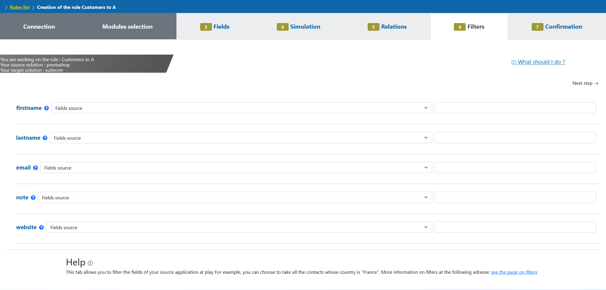

For each of your fields, you can select from a pre-set list of filters to apply.

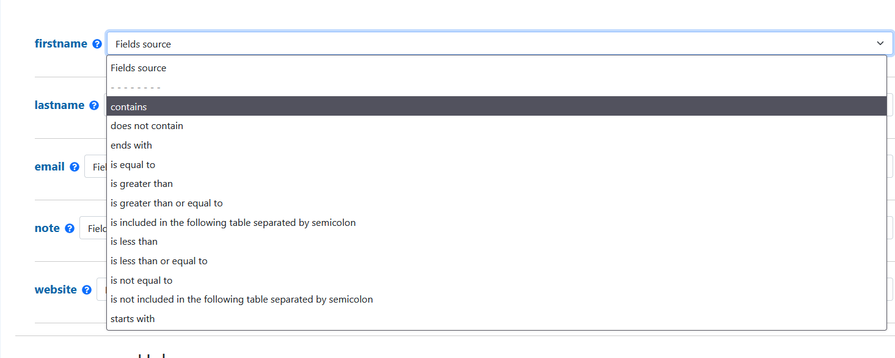

And then input the reference to use as a filter. Myddleware will apply this filter to this field inside your rule, meaning
that only the documents matching this exact filter will be sent to the read() method. 


## Formulae

> Myddleware embarks a set of valuable tools to facilitate data transformation, including the possibility to add what we call ``formulae``.
> Inside the Myddleware UI, you can create your own formulae to manipulate data before it is being transferred from your source application to your target.
> For instance, let's image your source application contains a ``first_name`` & a ``last_name`` field, but your target application only accepts a ``fullName`` field.
> This is no problem, as you can add a formula on the ``fullName`` target field in which you will be able to concatenate the 2 source fields for example.
> This is a basic example, however you are free to make much more complex formulae if you wish, thanks to a bunch of built-in PHP functions embarked with Myddleware.

### Fundamentals

For starters, formulas allow you to format or to set the values that will be sent to a given target field.
In other words, you have the option of adding fixed text to all uppercase, change timezones, concatenate several source fields etc.
From inside the Myddleware UI, you can create & peruse the available methods to create formulae during the rule creation process,
during the field mapping step. Indeed, once you've added a source field into a target field, you may then click on the ``Add formula`` button of
each target field and then a modal window will open allowing you to add your formula.

### Syntax

To help, syntax highlighting (1) is available to you right on your text box.
Furthermore, you will find below the list of source fields that you have chosen (2),
the available functions and their categories (3) and one or two dropdown list(s) (4) containing the different values
for the list type fields (as SalutationID example).

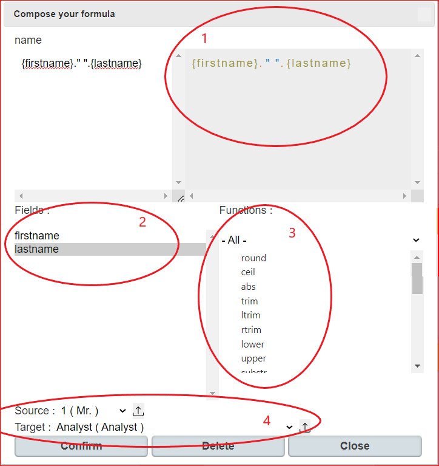

**Examples**

- To concatenate multiple fields, Myddleware uses the ``.`` symbol, just like in PHP

````php
{field1}.{field2}.' '.{field3}
{salutation}.' '.{first_name}.' '.{last_name}        // e.g. Miss Mary Spears
````
- To concatenate a fixed text with one or multiple fields “Client Name: “.{Firstname}.” “.{Lastname}

- Three-valued condition , “If the Greeting field is ‘Mr.’ then send 1, otherwise send 2” is written as followed : (({Greeting} == “Mr.”) ? “1” : “2”), those three-valued conditions can be nested in order, for example, to make the data correspond. Thus, ({resolution} == “10” ? “Open” : ({resolution} == “20” ? “Fixed” : ({resolution} == “30” ? “Reopened” : “Suspended”))) is correct and functional, this formula means “If resolution is 10 then ‘Open’ is sent, otherwise if resolution is 20 then ‘Fixed‘ is sent, otherwise if resolution is 30 then ‘Reopened’ is sent, otherwise ‘Suspended ‘ is sent.

- Add two fileds {field1} + {field2}

In this article we‘ll look at an important point in your synchronization rules and one of the many setting options offered by Myddleware, formulas.

**Functions**

In the formula of Myddleware, you can use the functions listed at the bottom right (see of the previous image).


Rounds a float, ([PHP](https://www.php.net/manual/fr/function.round.php)) **round(number [, clarification])**:

        round(525.6352, 2) // Returns 525.64

Rounds up, ([PHP](https://www.php.net/manual/fr/function.ceil.php)) **ceil(float)**:

        ceil(525.6352) // Returns 526

Returns the absolute value, ([PHP](https://www.php.net/manual/fr/function.abs.php)) **abs(number)**:

        abs(-5) // Returns 5

Deletes spaces (or other characters) at the beginning and the end of a string, ([PHP](https://www.php.net/manual/fr/function.trim.php)) **trim(string [, Masque])**:

        trim(” bonjour “) // Returns “bonjour”

Lowercases all characters, ([PHP](https://www.php.net/manual/fr/function.mb-strtolower.php)) **lower(STRING)**:

        lower(“BONJOUR”) // Returns “bonjour”

Uppercases all charachters, ([PHP](https://www.php.net/manual/fr/function.mb-strtoupper.php)) **upper(String)**:

        upper(“bonjour”) // Returns “BONJOUR”

Formats a local date/hour, ([PHP](https://www.php.net/manual/fr/function.date.php)) **date(Format [, Timestamp])**:

        date(“Y:m:d”) // Returns “2014:09:16”

Returns current Unix timestamp with microseconds, ([PHP](https://www.php.net/manual/fr/function.microtime.php)) **microtime([true if you want a float result])**:

        microtime(true) // Returns 1410338028.5745

Changes the timezone of the given date, ([PHP](https://www.php.net/manual/fr/timezones.php)) **changeTimeZone(Date you want to change, old timezone, new timezone)**:

        changeTimeZone(“2014-09-16 12:00:00”, “America/Denver”, “America/New_York”) // Returns “2014-09-16 14:00:00”

Changes the format of the given date, **changeFormatDate(Date you want to change, New format)**:

        changeTimeZone(“2014-09-16 12:00:00”, “Y/m/d H:i:s”) // Returns “2014/09/16 12:00:00”

Reads a string starting of the given Index, ([PHP](https://www.php.net/manual/fr/function.mb-substr.php)) **substr(String, Indexample)**:

        substr(“abcdef”, -1) // Returns “f”

Strips HTML and PHP tags from a string, ([PHP](https://www.php.net/manual/fr/function.strip-tags.php)) **striptags(String)**:

        striptags(“<p>Test paragraph.</p><!– Comment –> <a href=”#fragment”>Other text</a>”) // Returns “Test paragraph. Other text”

## Relationships

We can create relationships in Myddleware that not only allow us to transfer unrelated data items but whole data models entirely.

For instance, let's imagine we have a Prestashop to SuiteCRM rule which transfers customers. 
Now, if for instance we wanted to add another rule allowing us to send Prestashop ``orders`` to SuiteCRM ``opportunities``.
to send an ``order`` to SuiteCRM, we have to link it to the related ``account``. 
In order to do so, we need to retrieve the account's id corresponding to the customer linked to the order in Prestashop.

To do that, we will link this new rule to the previous rule where we will be able to find the SuiteCRM account id.

### Use case 1: One-to-Many relationships

> A One-to-Many relationship is when data from 1 module of your source app is sent to multiple modules in your target app.
For instance, the data from the Customer module of your source application (e.g. Prestahop in our example) will be sent 
to both Account & Contact modules in our target SuiteCRM.

#### Concrete example 

First, create a rule which sends Prestashop ``the e-shop s customers`` to SuiteCRM ``Accounts``. 

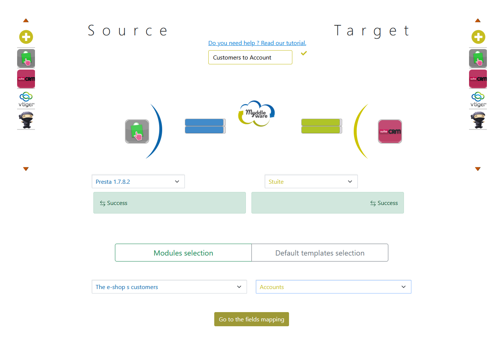

Then, create a second rule which will send data from the same Prestashop ``the e-shop s customers`` module to SuiteCRM’s ``Contacts`` module.
Map some fields, such as firstname, lastname, birthday and email for instance.

Then, in the ``Relationships`` tab of the rule creation view, we want to link the contacts to their accounts, which are 
already set up to being sent to SuiteCRM's ``Account`` module in the first rule you created.
In this scenario, Myddleware would have to retrieve the SuiteCRM account IDs from the previous rule 
and send them into the contacts in order to link these contacts and the accounts that have already been created.
Therefore, you need to select the following fields : 

| Source       | Rules                                        | Target      |
|--------------|----------------------------------------------|-------------|
| ID customers | name_of_your_first_Customer_to_Accounts_rule | Account ID  |

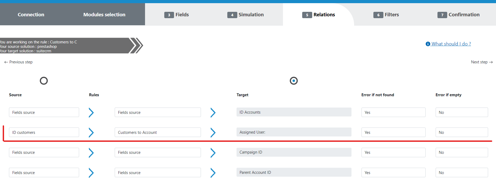
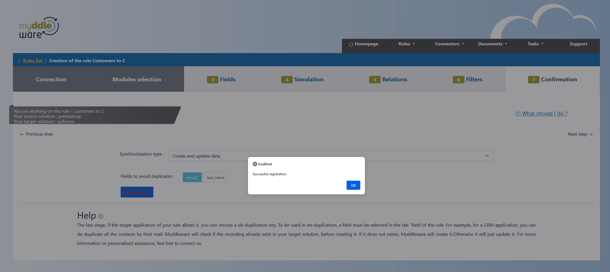
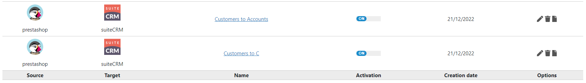

Now save the rule and run it. Don’t forget to select a reference date in the past if you want to retrieve data which already exists in Prestashop.

Now open a document. You will find that Myddleware has linked the right account to the matching contact.

The source document id is used twice in the source data : the first time for the contact and the second time for the account. 
At this point, you have just created your first one-to-many relationship, ie one customer to 2 records (contact and account).

### Use case 2: Many-to-One relationships

> A Many-to-One relationship is when data from multiple modules of your source app is sent to a single module in your target app.
For instance, the data from the ``Customer`` & ``Address`` modules of your source application (e.g. Prestahop in our example) will be sent 
to the Account module in our target SuiteCRM.

#### Concrete example

To illustrate Many-to-One relationships, we will first create an ``Addresses`` to ``Accounts`` rule (Prestashop to SuiteCRM).
First, select ```The Customer, Brand and Customer addresses``` source module and ``Accounts`` as a target module.

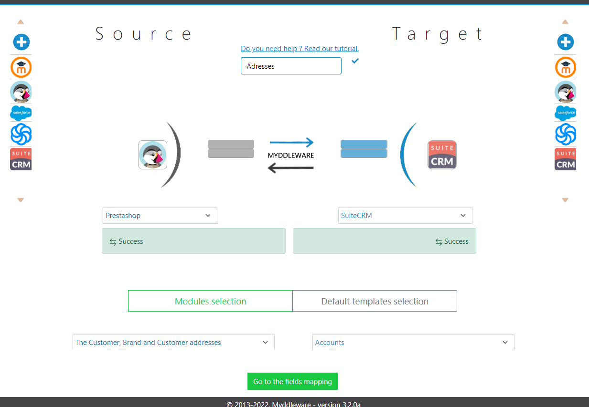

Map some fields such as ``address1``, ``address2``, ``city``, ``postcode``, etc.

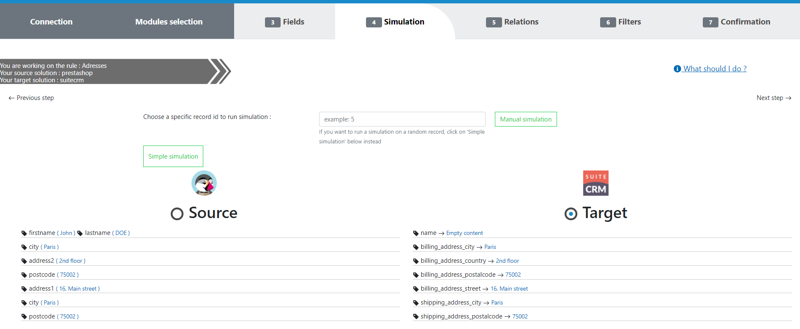

Then open the “Relationship” tab. We want to send the addresses to the accounts that have already been sent to SuiteCRM 
in a previous rule. Just like the one to many relationship scenario, Myddleware will have to spot the SuiteCRM account 
IDs in the previous rule then update this account :

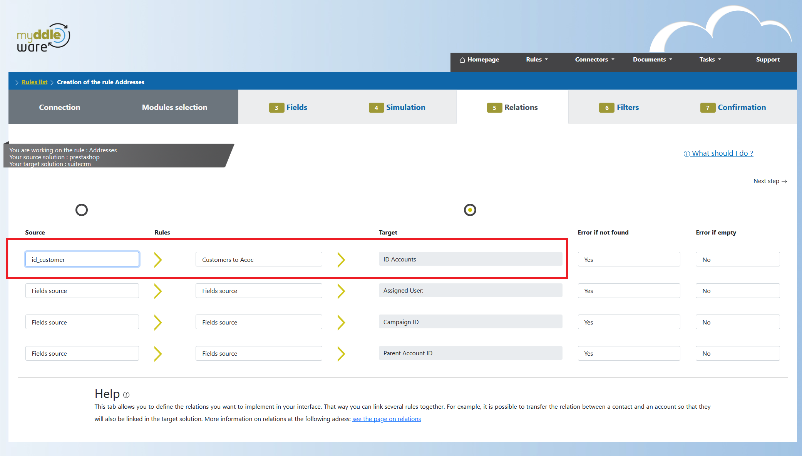


Here, we use the ``Account ID`` ie the ID of the target module in the current rule. This means that this rule will only update data.
Now save the rule and run it. Don’t forget to put the reference date in the past if you want to retrieve already-existing data in Prestashop.
Now open a transfer. You will see that Myddleware has found the right account to update :

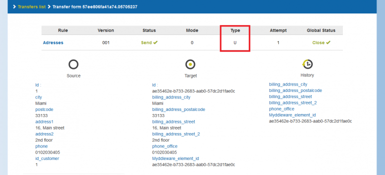

## Bidirectional rules 

In our example, we have only shown you how to send data from Prestashop to SuiteCRM.
But in reality, Myddleware allows you to send data in both directions, from Prestashop to SuiteCRM and from SuiteCRM to Prestashop (for example).

One of the rules we have created is sending Prestashop Customers to SuiteCRM contacts. 
In this case, only modifications in Prestashop will be sent to SuiteCRM. But if the contact is modified in SuiteCRM, 
the modification won’t be sent to Prestashop.

So let’s create a new rule which will send SuiteCRM contacts updates to Prestashop. 
Select the same modules and connectors you used in your previous rule but in the opposite direction :

- source: SuiteCRM > ``Contacts``
- target: Prestashop > ``the e-shop s customers``

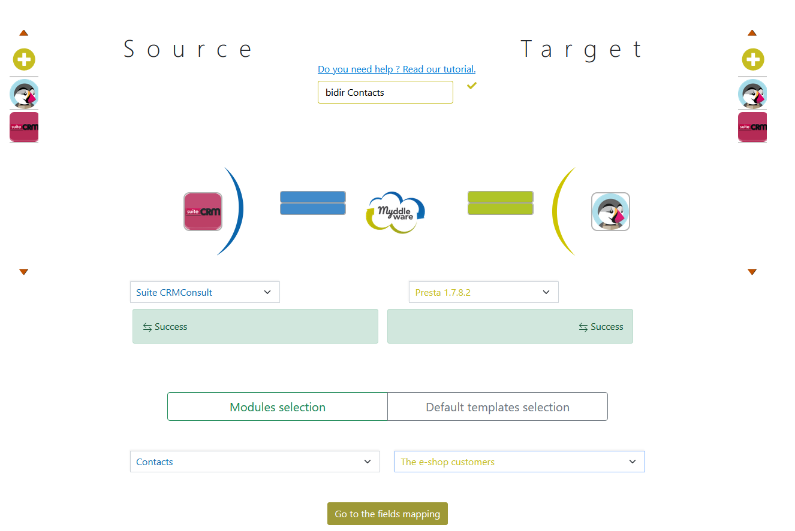

Map some fields such as ``firstname``, ``lastname`` and ``email`` for instance. 

!> Make sure you don’t use a field that will be updated everytime like the modification date of the record, you could create an infinite loop otherwise ! 

Go to validation. A new field will be displayed ie “Bidirectional synchronization” in addition to the opposite rule. 
Select the opposite rule and click on “Confirm” :

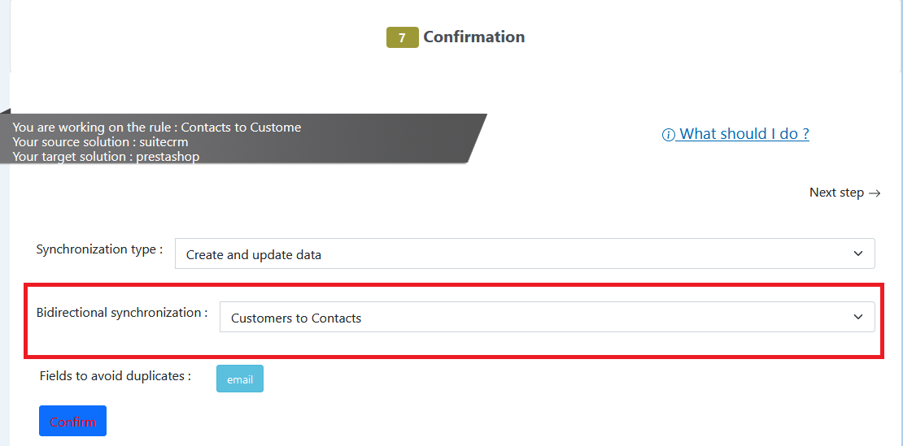

The opposite rule is displayed on the rule’s detailed view :

Activate both rules. Now, to test your bidirectional rule, modify a customer in Prestashop, go to the rules list view 
and click on ``Execute all active rules`` :

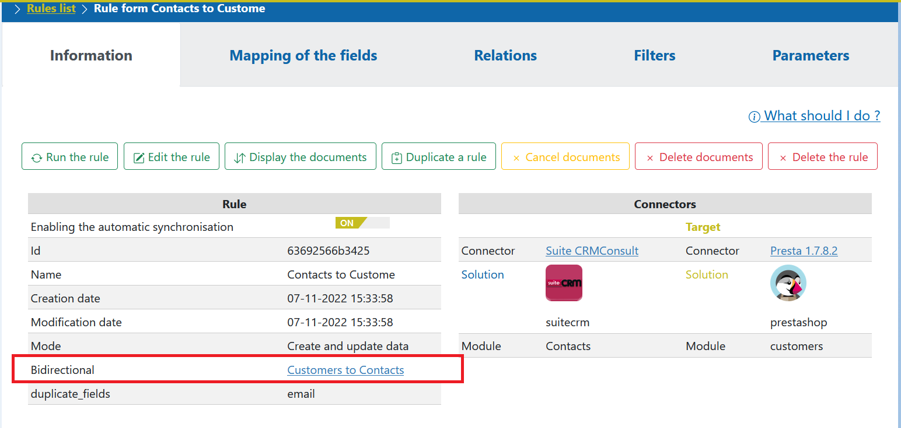

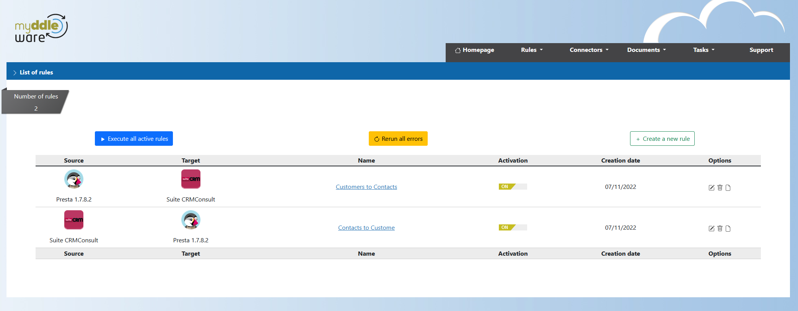

Now open the task, you will see the contact that has been sent to SuiteCRM.

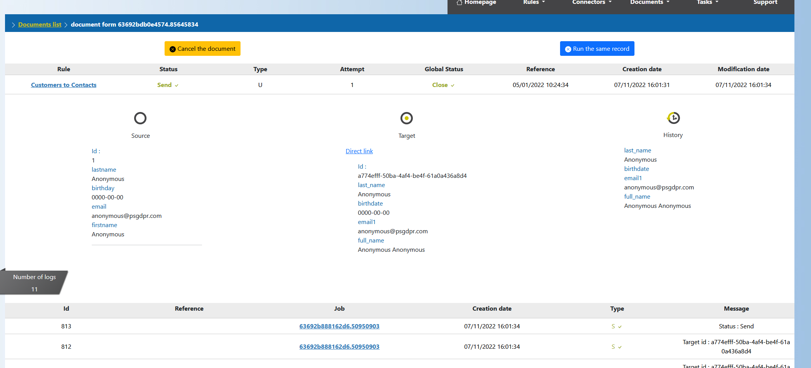

Notice that in SuiteCRM, the contact’s name was “Doe test” and but the name that was sent is “Doe”.  
The name is now modified in SuiteCRM. Return to the rules list view and click again on “Execute all active rules”. 
Another transfer is sent as a result of Myddleware reading in SuiteCRM and detecting the modification we’ve just made. 
The transfer will automatically be cancelled to avoid an infinite loop :

The reason for this being that the data is already updated in Prestashop (which is normal since Prestashop is the source 
solution from which the data is being sent). So Myddleware detects that there are no modifications to send to Prestashop
and thus cancels the transfer and stops what could result in an infinite loop.

Now you have to do this test in the opposite direction. To do so, modify the contact in SuiteCRM and return to the rule 
list view. Click once again on “Execute all active rules”. You only need to run the rules once, not twice as we did in 
the previous case. In fact, it depends on which rule has been activated first when you click on “Execute all active rules”. 
In one direction, you have to click on “run all rules” twice, in the other direction, once is enough.

At this point, your modification in SuiteCRM should be visible in Prestashop :

Once Myddleware detects the modification in Prestashop, it will try to send it to SuiteCRM. 
But once again, the transfer will be cancelled to avoid an infinite loop :

If the transfer isn’t cancelled, your server will continue to update the same contacts every time. To avoid this, you will 
have to detect why the transfer isn’t cancelled. It could be because you used the modification date, or because the data
format is not the same in both applications. 
To solve this problem, remove some fields in your rule or create a formula to have the same data format in both applications.