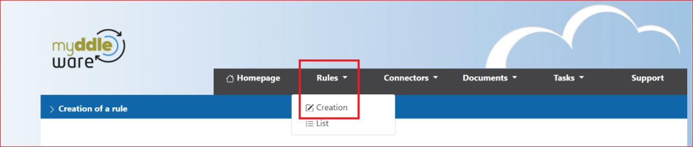
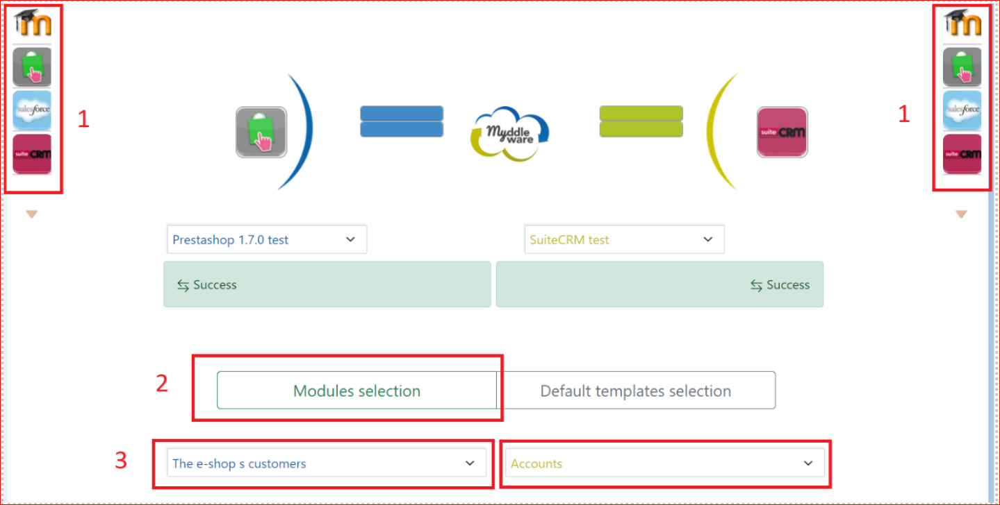
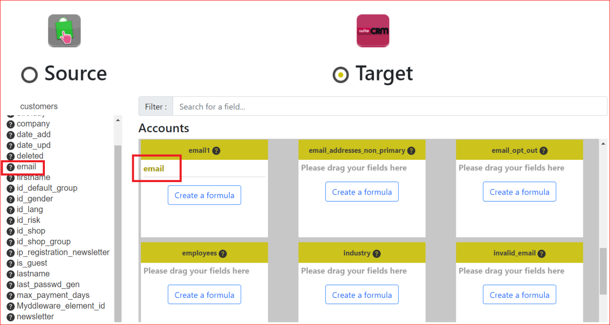
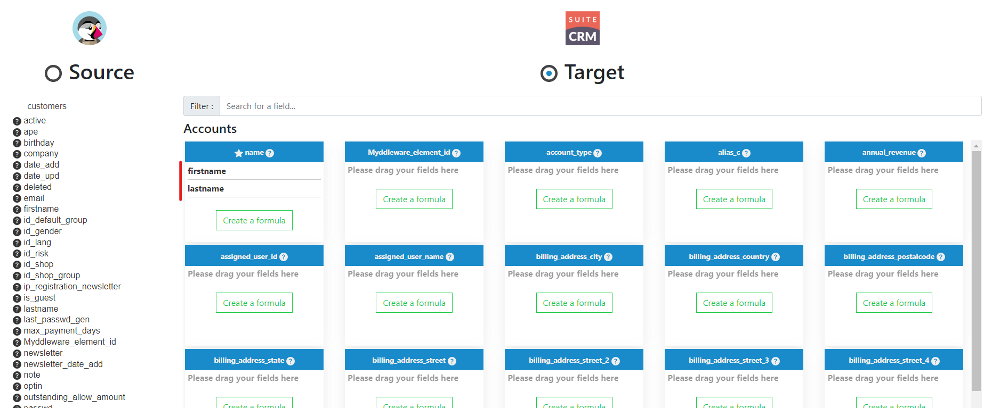
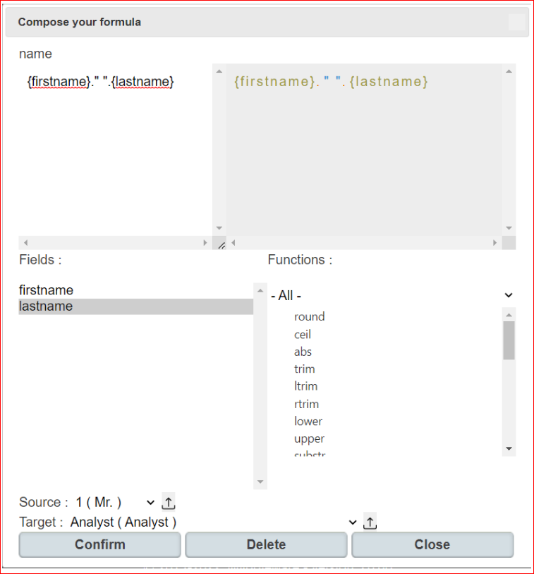
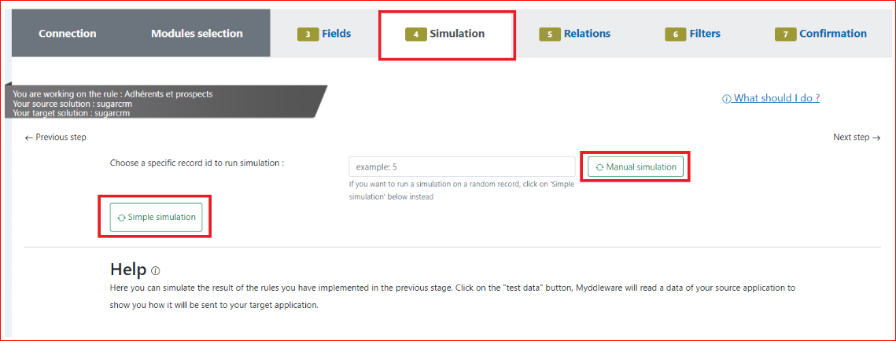
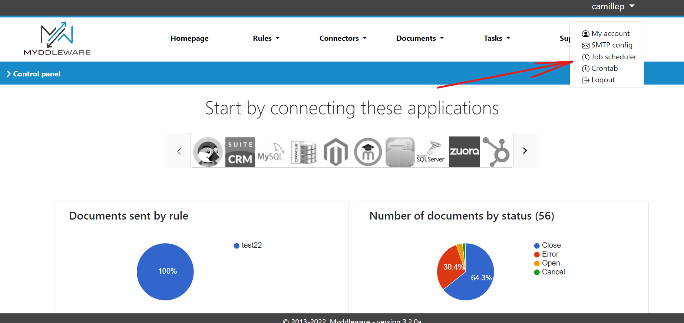
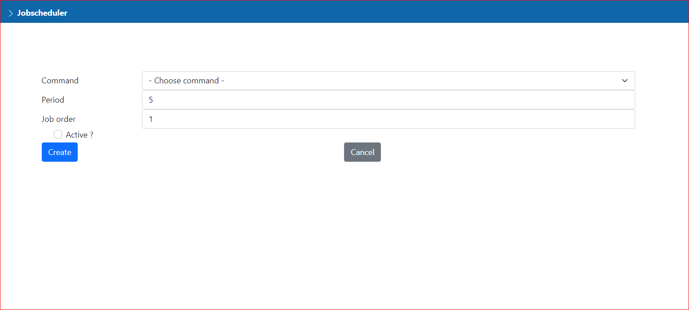
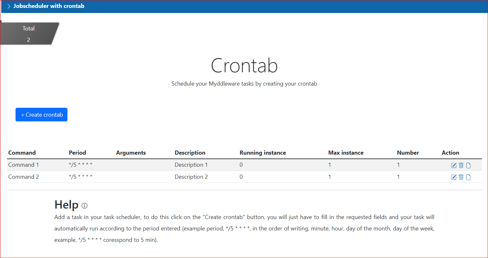
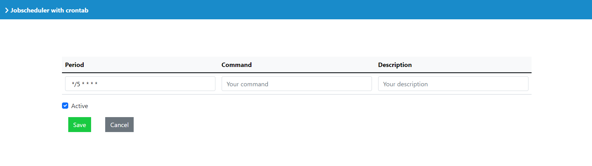

# Basic usage

## Connectors

*This section is still under construction*

## Rules

### Creating your first rule

Rules are at the core of how Myddleware works. You can create as many as you want and as many as you need.

A rule is basically a job which sends your data from a module to another module. It’s just like transfering something from a box to another, with all the changes it implicates if the first box is square and the second is a circle. The transfer is a copy, so no data can be erased.

To create a rule, log in to your Myddleware instance then click on **Rules** then **Creation** in the navbar.



### Selecting data

First, you need to choose your environment's source and target connectors (see 1), then you will select the two modules you need to sync (see 2 & 3).



Do not forget to give a name to your rule or you won’t be able to select your modules.

In our example we chose **the e-shop s customers**, wich have the information we need to fill the ```Accounts``` module in our target.  

!> It is important to know exactly from which module the data you need comes from, and in which module you want it to be copied. Indeed, you won't be able to change this part later.

### Mapping fields

Once you've named & decided on the modules you want to synchronise, you will be redirected to the fields mapping step. This is where you will define the general pattern for each data transfer made by your rule, field by field.

To map your fields, you just have to drag and drop the source field to the target field. For instance, here we've selected the the source field **email** from the ```Customers``` module of our PrestaShop application and we've place it in the **email1** target field from the ```Accounts``` module of our SuiteCRM application. You can map as many fields as you need and can even send multiple sources into one target.

> NB: please note you don't have to map **all** source/target fields, you can simply select a few if that's what you need. However, some of them will be required, depending on the target app



### Apply formulas to transform data before it is sent to the target app

Sometimes, the source data mapping doesn't quite match the target app's own mapping. But don't worry! Myddleware allows you to operate transformations on the data you want to send in order to fit with the target requirements. This is possible thanks to Myddleware's *formulas* system.
Indeed, for each target field, you can create a formula to modify the source data to fit the type, length,... and other requirements from the target field.

**Example:**
In our example, we want to map PrestaShop Customers' data to be sent to SuiteCRM's Accounts module. However, PrestaShop only maps Customers' **first_name** and **last_name** whereas SuiteCRM provides us with a **name** field. Ideally, we would want to add up our source's  **first_name** and **last_name** in order to fit SuiteCRM's name field's logic. To do so, we need to drag and drop this **first_name** and **last_name**, and create a formula to concatenate them.





You can double-click on the data in “Fields” to make it appear in the formula area. To concat use ```‘.’```, the quotes are here to make a space. The result will be to have the first name, a space, the the last name in our fields name.

>To test your formula and your mapping, you can go to ```“simulation”```



Then you can run “Simple simulation” to visualize an example of the transfer, you can also check if your formula transform the data the way you want.

!>We will talk about the tabs "Relationships" and "filters" in another chapter

### Confirm the rule

To finish the creation of this rule, click on “Confirmation” :

!>IMAGE Confirm rule

You will then see 2 parameters :

<!-- tabs:start -->

#### **Synchronization type :**

 Depending on the solution, you could have the choice to read newly created data or all data, created or modified in the source module. In our example, if you only want to send new customers created in Prestashop to SuiteCRM, then select ```“Create data only”```. Otherwise, if you only want to send customers’ modifications in Prestashop to SuiteCRM, then select “Create and update data”. In our example we selected ```“Create and update data”```. This process is based on the reference date that you can set up.

#### **Avoid duplicates fields :**

 You can select one of these fields if you want Myddleware to check if a record with the same value already exists in the target solution. If so, Myddleware will only update this data and won’t create a duplicate. But to be able to duplicate a field, the field must be present in the fields mapping. In our example, we selected ```“Email”```.

<!-- tabs:end -->

Finally, you can click on “Confirm” to create the rule. After which, the page with the detail of your rule should appear.

### Rule detail

When you open a rule, all its details appear :

!>IMAGE rule detail

## Set up your jobscheduler (Jobscheduler/crontab)

### Using jobscheduler in the Myddleware interface

On your Myddleware interface you have the possibility to create your periodic tasks, click on your username on the top right and click on ```"jobscheduler"``` :  



Here you will find the list of your tasks, with the possibility to modify or delete a task through the action column.


To create a new task click the New command button. You will then be redirected to the command creation page:  

Here you will first have to select the type of command you want to create, depending on your choice you will have different parameters to enter.



**For the following fields**

<!-- tabs:start -->
#### **Period**

this is the time interval corresponding to the frequency of execution of your task

#### **Job order**

This is the order in which the tasks will be executed

#### **Active**

 Active ? Allows you to deactivate/activate a scheduled task

<!-- tabs:end -->

### Using crontab in the Myddleware interface

Just like with Jobscheduler you can use to create new periodic tasks directly via Myddleware, to do this click again on your username, then click on ```"Crontab"```.



**For the following fields**

<!-- tabs:start -->
#### **Arguments**

#### **Number**

#### **Description**

#### **Running instance**

#### **Period**

 As for jobscheduler, period is a time interval corresponding to the frequency of execution of your task. Here on the other hand the syntax to use is precise example (*/5* ** * : in the order of writing, minute, hours, day of the month, day of the week).

 Syntax example :

<!-- tabs:end -->

Here you will find a table with all your periodic tasks, to create a new command click on the ```"create crontab"``` button


