# Basic usage

## Connectors

In order to be able to synchronise data from your applications, Myddleware relies on *connectors*.
A connector is the object which allows Myddleware to connect to your solution (SuiteCRM, WooCommerce or Prestahop for example). 
Thanks to connectors, Myddleware can read and/or write data into the connected solution. Therefore, each solution you would like Myddleware
to interact with, whether it be as a source or target application, will need to have its own Myddleware connector.

> For the same solution, you can have multiple connectors. For example, let's imagine you own 3 WooCommerce websites, you can have a connector for each of these. 
> You can even have multiple connectors for the same application, for instance by connecting to the app using various credentials.

### Create a connector

To create a connector, navigate to the **Connectors** tab and select *Creation*

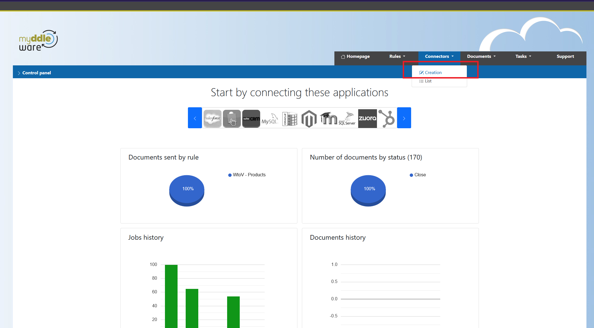

Now, first select the solution you would like to connect. In the example below, we've selected SuiteCRM. Each solution uses their own custom credentials.
A form will therefore be displayed which you will need to fill in using the credentials provided by your solution.
To ensure your credentials are accurate, you can click on the **Test** button and Myddleware will let you know right away whether the connection was successful or not.

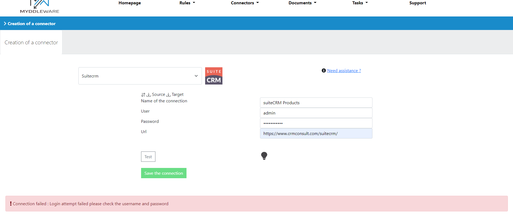

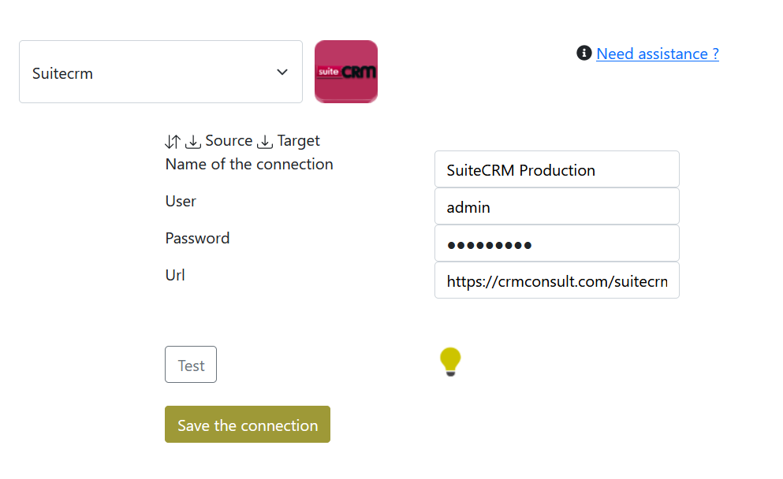

If the credentials are right, you may now save your connector. You will then be redirected towards the list of all your connectors.


### View my connectors

To access the list of all your connectors, simply go to the **Connectors** tab and select *List*.

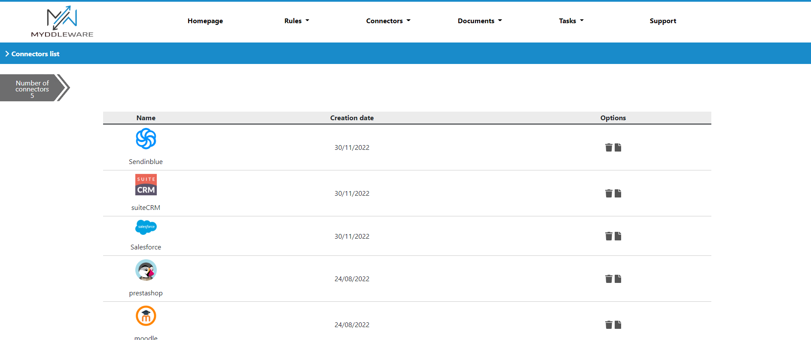

From here, you will be able to either update or delete a connector if needed by clicking on the icons in the **options** section.

### Edit or delete a connector

If your solution credentials have changed, you can update a connector, test whether the credentials are still valid and then save your updated connector. 

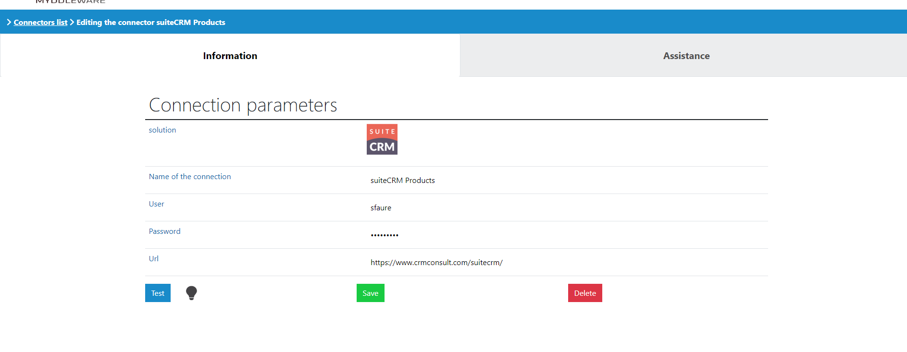

## Rules

### Create a rule

> Rules are at the core of how Myddleware works. You can create as many as you want and as many as you need, but each rule will require a **source** connector & a **target** connector.

A rule is basically a job which sends your data from a module to another module. It’s just like transfering something from a box to another, with all the changes it implicates if the first box is square and the second is a circle. The transfer is a copy, so no data can be erased.

To create a rule, log in to your Myddleware instance then click on **Rules** then **Creation** in the navbar.


#### Select connectors 

First, you need to choose your environment's source and target connectors (see 1), then you will select the two modules you need to sync (see 2 & 3).


Do not forget to give a name to your rule, otherwise you won’t be able to select your modules. In the example above, we've chosen to create a rule which will have Prestashop as a **source** from which to read data, which will then be sent to SuiteCRM as a **target**.

#### Select modules

In our example, we selected  ```the e-shop s customers``` as a source module, meaning that Myddleware will read data from there, transform it and then send it to SuiteCRM's ```Accounts```  target module.  

!> It is important to know exactly from which module the data you need comes from, and in which module you want it to be copied. Indeed, you won't be able to change this part later.

#### Map some fields

Once you've named & decided on the modules you want to synchronise, you will be redirected to the fields mapping step. This is where you will define the general pattern for each data transfer made by your rule, field by field.

To map your fields, you just have to drag and drop the source field to the target field. For instance, here we've selected the ```email``` source field from the ```Customers``` module of our PrestaShop application and we've place it in the ```email1``` target field from the ```Accounts``` module of our SuiteCRM application. You can map as many fields as you need and can even send multiple sources into one target.

> NB: please note you don't need to map *all* source/target fields, you can simply select a few if that's what you need. However, some of them will be required, depending on the target application. Required fields will be marked with a star symbol next to their name in Myddleware.


#### Apply formulae to transform data before it is sent to the target app

Sometimes, the source data mapping doesn't quite match the target app's own mapping. But don't worry! 
Myddleware allows you to operate transformations on the data you want to send in order to fit with the target requirements.
This is possible thanks to Myddleware's *formulas* system.
Indeed, for each target field, you can create a formula to modify the source data to fit the type, length, format... and other requirements from the target field.

###### Simple string concatenation formula example

In our example, we want to map PrestaShop customers' data to be sent to SuiteCRM's ```Accounts``` module. 
However, PrestaShop only maps customers' ```first_name``` and ```last_name``` whereas SuiteCRM provides us with a ```name``` field. 
Ideally, we would want to add up our source's  ```first_name``` and ```last_name``` in order to fit SuiteCRM's name field's logic. 
To do so, we need to drag and drop ```first_name``` and ```last_name```, and create a formula to concatenate them.
Then, click on the **Create a formula** button.

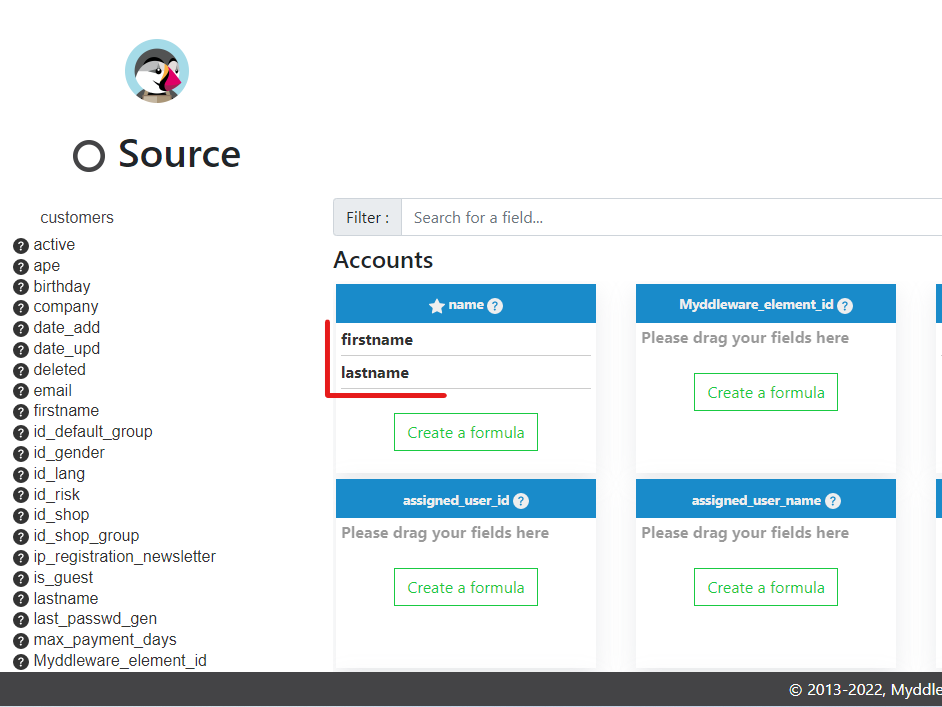

You can double-click on the data in the “Fields” section to make it appear in the formula area at the top. 
The code you will use for this formula is PHP. Therefore, in order to concatenate 2 fields, we will need to use ```." ".``` between our 2 variables. 
For example, if you input the following formula: 

````php
    {firstname}." ".{lastname}
````

You would get the following result inside the target application :

````text
    John Doe
````


###### Pre-formatting data using the target application

Formulas also allow you to add pre-formatted data inside your target application which does not necessarily come from your source app. 
For instance, when sending customers from Prestashop to SuiteCRM's ```Account``` module,
you might want to tell Myddleware that all the accounts will have a ```Customer``` type by default in the ```account_type``` field in the target application (SuiteCRM).
To do so, you will need to click on the target field's **Create a formula** button (here, we will use ```account_type```).
The formula modal will open. From there, click on the **Target**  dropdown list at the bottom and select the default value you want to use.
In our case, we will select ***Customer**.

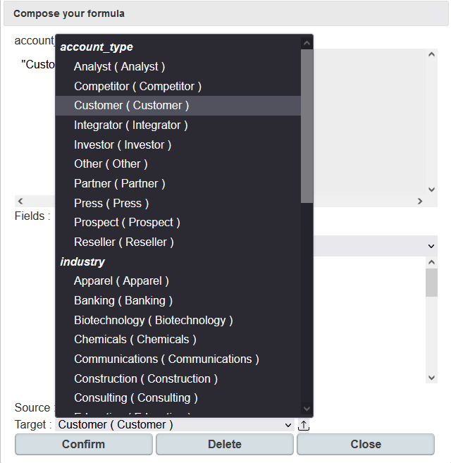

Then, you need to click on the small arrow next to the dropdown list in order to 'push' this value into the top right field. Don't forget to click on 
the **confirm** button.

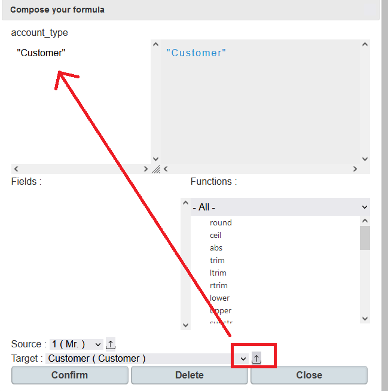

Now, you should be able to see the value you've selected in your formula directly inside the target field's box.

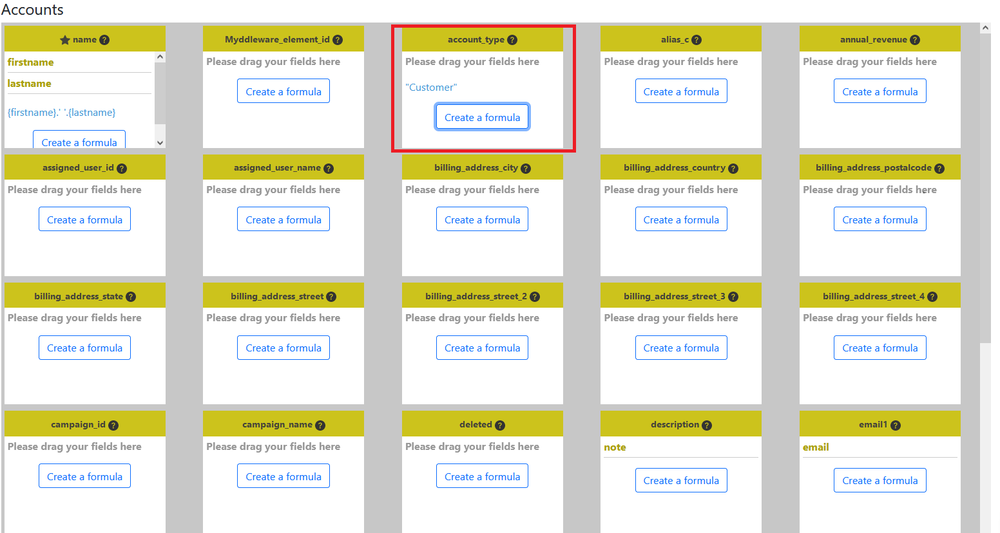


#### Simulate a data transfer 

>To test your formula and your fields' mapping, you can go to the  ```simulation``` tab


Then you can run a **Simple simulation** to visualize a sample data transfer. 
You can also check whether your formulae actually transform the data the way you intend them to.

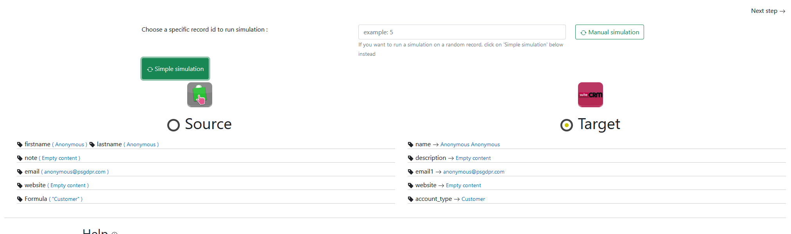

If you would like to verify your data using a specific record from your source application, you can run a **Manual simulation** to visualize
the transformations on that specific record. To do so, you will therefore need to get that document's ID from inside your source application.
For example, if I want to check my data using the PrestaShop customer whose ID is 2, 
I will input ```2``` into the field at the top, and then run the **Manual simulation**
button, which will get me the following result:

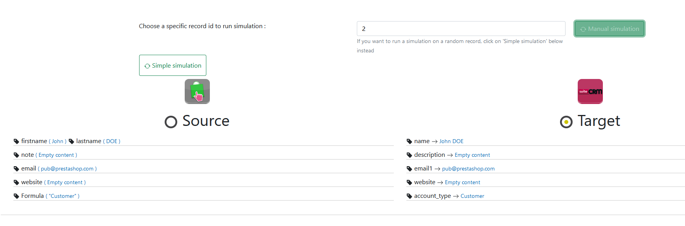

If you are satisfied with the current simulation, you can either directly save your rule by clicking the ````confirm```` button on the ```Confirmation``` tab,
or you can make even further transformations to your data by adding ```Filters``` & ```Relationships``` to your rule. To find out more about these options,
please go to the  [Advanced usage section](# Advanced_usage) of this documentation. 


#### Confirm the rule

To finish the creation of this rule, click on “Confirmation” :

!>IMAGE Confirm rule

You will then see 2 parameters :

<!-- tabs:start -->

#### **Synchronization type :**

 Depending on the solution, you could have the choice to read newly created data or all data, created or modified in the source module. In our example, if you only want to send new customers created in Prestashop to SuiteCRM, then select ```“Create data only”```. Otherwise, if you only want to send customers’ modifications in Prestashop to SuiteCRM, then select “Create and update data”. In our example we selected ```“Create and update data”```. This process is based on the reference date that you can set up.

#### **Avoid duplicates fields :**

 You can select one of these fields if you want Myddleware to check if a record with the same value already exists in the target solution. If so, Myddleware will only update this data and won’t create a duplicate. But to be able to duplicate a field, the field must be present in the fields mapping. In our example, we selected ```“Email”```.

<!-- tabs:end -->

Finally, you can click on “Confirm” to create the rule. After which, the page with the detail of your rule should appear.

### Rule detail

When you open a rule, all its details appear :

!>IMAGE rule detail


[//]: # (# Advanced_usage)
