# Available Myddleware connectors

Each connector will require a different set of credentials for Myddleware to be able to link your applications together.
This page aims to give you some guidance on how to obtain your credentials depending on the app you intend to connect to Myddleware.

!> Disclaimer: some of these connectors are currently under scrutiny / maintenance due to the fact that when an app provider decides to 
update their webservice, Myddleware code needs to be updated to reflect these changes too. If you detect any errors or missing information, please do not hesitate
to let us know by raising an issue on our [GitHub Issues forum](https://github.com/Myddleware/myddleware/issues).

## CMS apps

### WordPress

Tne WordPress API is public and does not require any login credentials. Therefore, all you will need to be able to create
your WordPress connector will be your website's ``URL``.

Myddleware can currently read the following modules :

| Module   | Source | Target |
|----------|--------|--------|
| Posts    | Yes    | No     | 
| Pages    | Yes    | No     | 
| Comments | Yes    | No     |

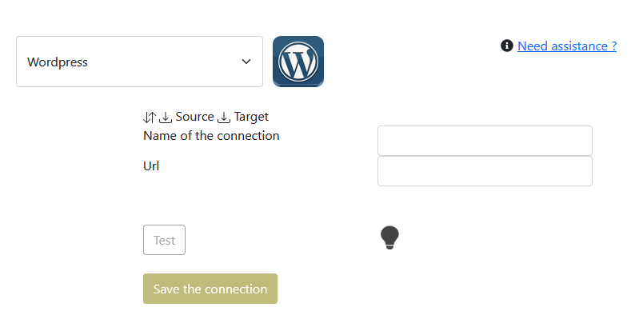

## CRM apps

### Airtable

Airtable modules are entirely custom and Myddleware is able to read, write & delete data in any Airtable base.
For Myddleware to be able to connect to your Airtable application, you need to provide the following:

- your project ID (Airtable base)
- your API key / token

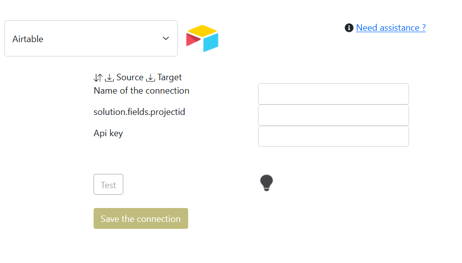

To get your project (base) ID, you can obtain it from many ways. For example, by clicking on your
base's logo and accessing it, it will then be displayed in your URL.

Or, from your base, you can access the API documentation of that specific base by clicking on the ``Help`` icon, which will
open a sidebar menu. Scroll down to ``ÀPI documentation``. This will open a new page with the API documentation for this 
particular base and you will find the ``project's base ID`` at the top.

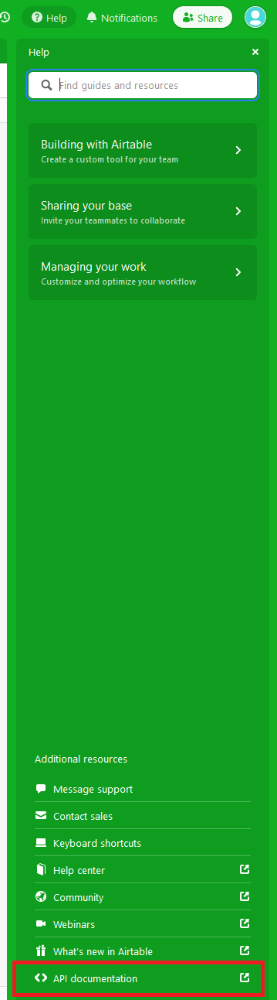

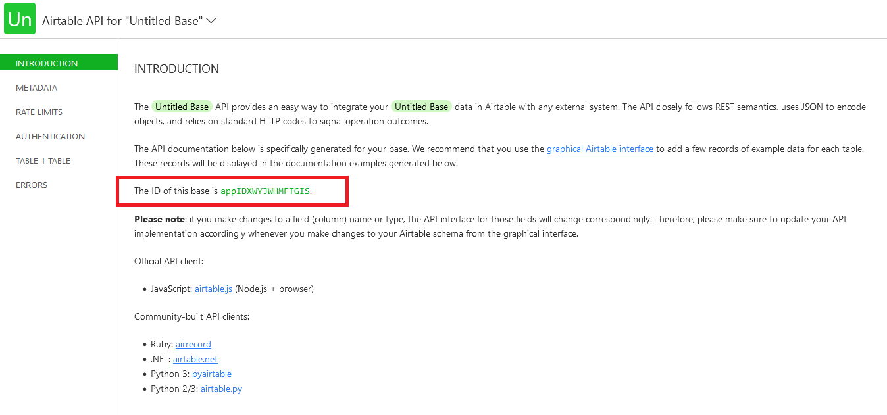

To get your ``API key``, login to Airtable and go to your [account](https://airtable.com/account).

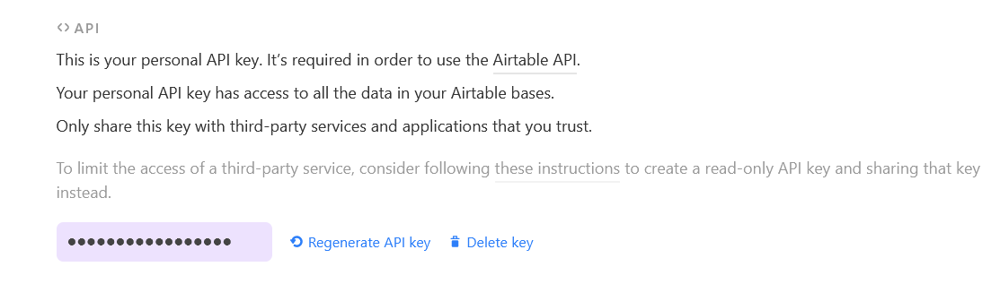

### Cirrusshield

Myddleware is able to read and write all Cirrus Shield modules, even the custom ones.

To create your Cirrus Shield connector, you will need :

- Your username 
- Your password

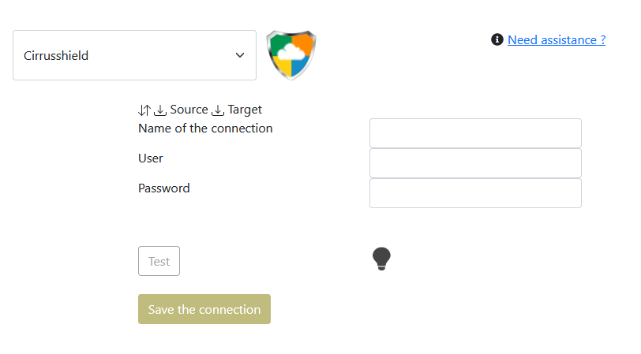

### Hubspot

Here is the list of available modules in source (reading) and target (writing) :

| Module                                            | Source | Target |
|---------------------------------------------------|--------|--------|
| Companies                                         | Yes    | Yes    | 
| Contacts                                          | Yes    | Yes    | 
| Deals                                             | Yes    | Yes    | 
| Engagement  (task, email, meeting, note and call) | Yes    | No     | 

To create your hubspot connector, you will need your API key.

> Please, follow this tutorial to get your API key : https://knowledge.hubspot.com/articles/kcs_article/integrations/how-do-i-get-my-hubspot-api-key

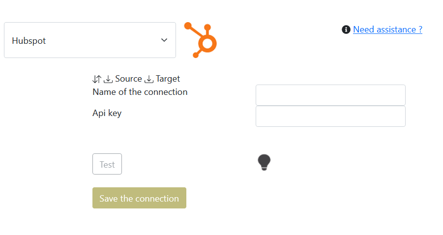

### SageCRM

Myddleware can read and write all Sage CRM modules, even the custom ones.

To create a SageCRM connector, you will need:

– Your user email address
– Your password
– A WSDL file that you need to download

The user and the password are those you use to access your SageCRM account.

To download the WSDL file, you must connect to your SageCRM account and click on “Administration”.

Once you’re in “Manage My Account”, click on “External Access” and then on “View Web Services WSDL”.

A new page opens. You have to save it.

Now, go to your Myddleware environment where you will create a new connector. 
After typing in your email address and password, click on “wsdl file”. Choose the file you just downloaded and then transfer it.

The file has been transferred successfully.

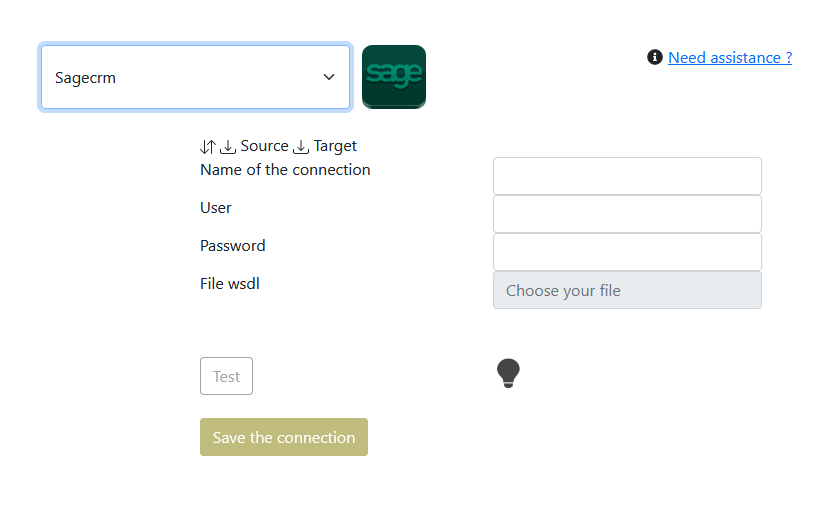

### Salesforce

Myddleware can read and write all Salesforce modules, even the custom ones.

To create your Salesforce connector, you will need the following credentials: 

- Your username 
- Your password 
- Your token 
- Your consumer key 
- Your consumer secret 
- Indicate if you are connecting a sandbox or not (0 or 1)

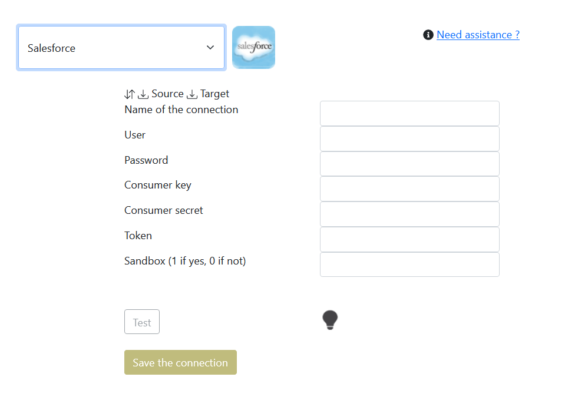

#### Where to find your security token ?

Log in to Salesforce with your username and password.
1) From the homepage of your account, click on your avatar/profile icon in the top-right corner, then select ``Settings``.
2) In the left-hand menu, under ``My Personal Information``, click on ``Reset My Security Token``.
3) Finally, click on ``Reset my security token`` (it will be sent by email).

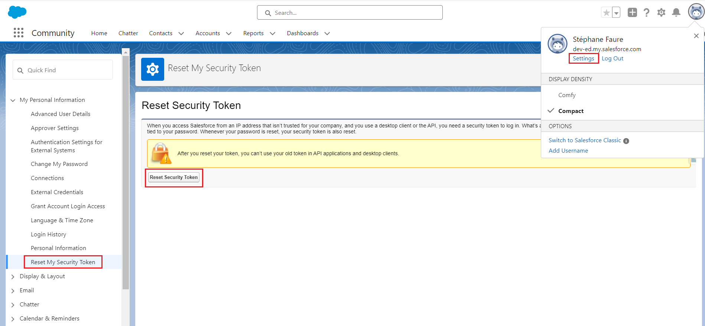

#### Consumer Key and Consumer Secret

You need to create an app. 

1) To do so, click on your name, then on ``Setup``.

2) Then, on the left-hand side, go to the ``Platform Tools`` section, then click on ``Apps``, then ``App Manager``.
   
3) Create a connected app by clicking on ``New Connected App`` in the top-right corner of the App Manager screen.

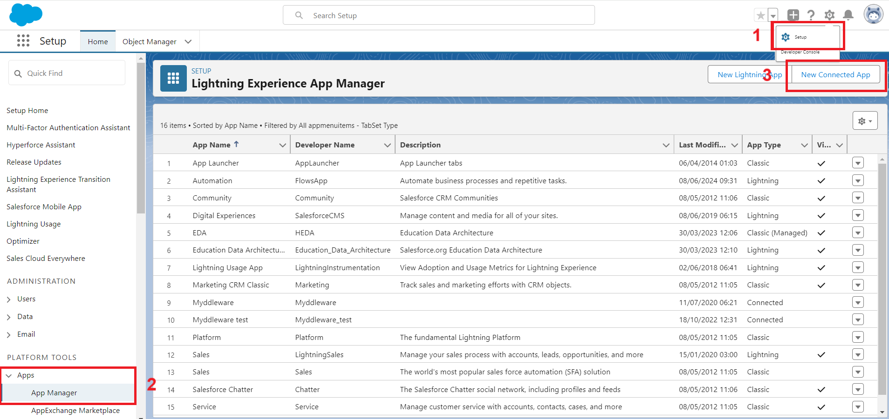

1) Input your App's name, API name and email address.
2) Then, enable OAuth Settings by clicking on the checkbox.
3) Insert your Salesforce URL in the ``Callback URL`` section.
4) Then, select ``Full access`` by double-clicking on it.
5) Click on the small arrow on the right
6) The selected `` Full access`` scope should now have moved to the ``Selected OAuth Scopes`` box.
7) Save.

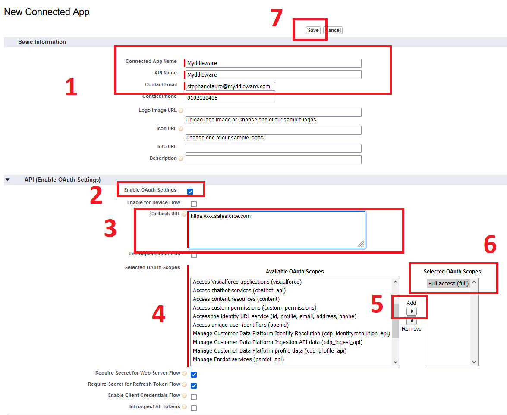

Click on ``Continue``. You will be redirected to the presentation page of your app.

To get your Consumer Key & Consumer Secret, you will then need to click on the ``Manage Consumer Details`` button.
At this stage, 2-factor authentication will require a code, which will have been sent to you via email. Insert this code.

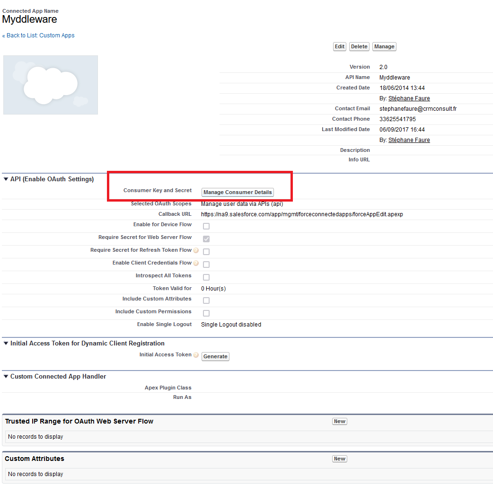

You will then be redirected to the Consumer Key & Secret page.
Here, you’ll find your ``Consumer Key`` and ``Consumer Secret`` which you can now copy & paste into the Myddleware credentials form.

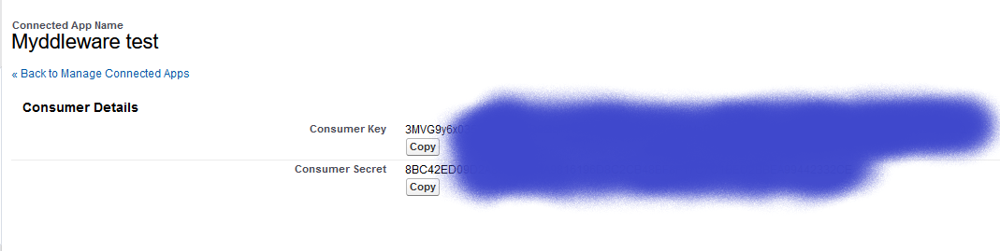

### SAP CRM

The SAP CRM connector can only be installed by our team.

To know more about this connector, please fill in [this contact form](http://www.myddleware.com/contact-us).

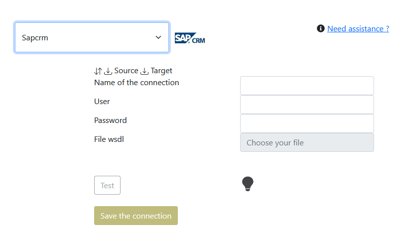

### SugarCRM

Myddleware is compatible with SugarCRM CE and SugarCRM PRO v6.2 and upper versions.

Myddleware can read and write all SugarCRM modules, even the custom ones.

To connect SugarCRM to Myddleware, you need :

- your username
- your password
- your URL

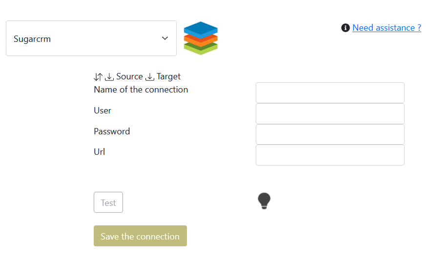

> Tip: Use the username and password of a user with sufficient access control privileges to make the rules, write access, read, edit.

### SuiteCRM 7

Myddleware can read and write in all SuiteCRM modules, even the custom ones.

To connect SuiteCRM to Myddleware, you need:

- your username
- your password
- your URL

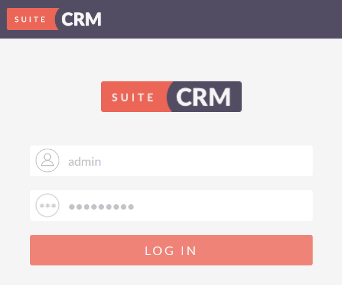

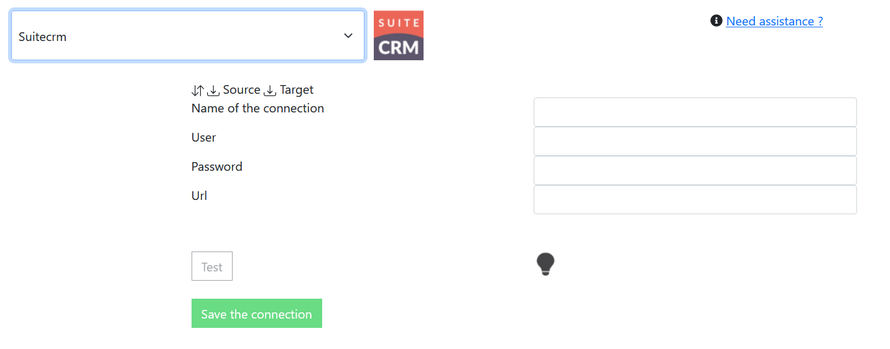

### VTiger

Myddleware can read and write into all Vtiger modules, even the custom ones.

To connect Vtiger to Myddleware, you need
- your username
- your access key 
- your URL

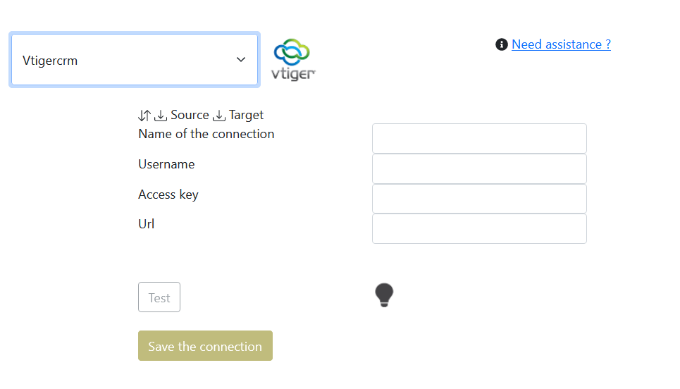

To get your access key, click on the user menu in the top right corner, then click on ``My preferences``, scroll down,
your ``Access Key`` should be at the bottom.

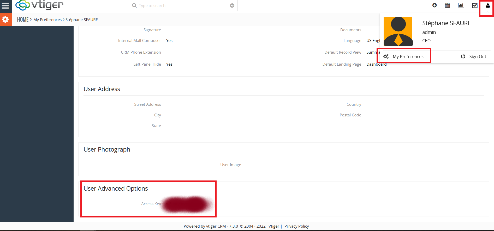

## ERP apps

### ERPNExt

Myddleware can read and write all ERPNext modules, even the custom ones.

To connect ERPNext to Myddleware, you need :

- your username
- your password
- your URL

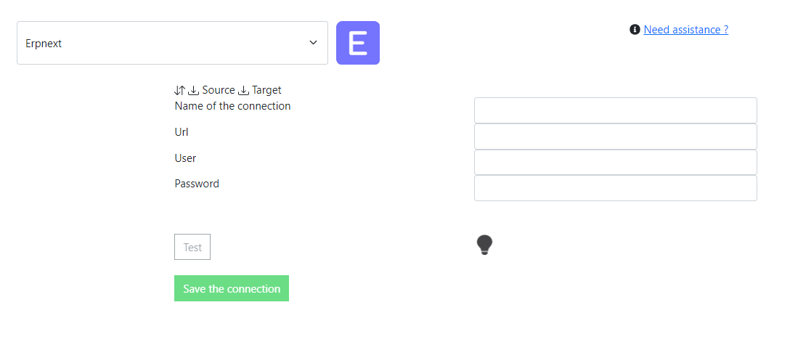

## E-commerce apps

### Magento

Myddleware is compatible with Magento 2.

Here is the list of available modules in source (reading) and target (writing) :

| Module                                             | Source | Target |
|----------------------------------------------------|--------|--------|
| Customers                                          | Yes    | Yes    |
| Customer Addresses                                 | Yes    | No     |
| Orders                                             | Yes    | No     |

To connect Magento to Myddleware, you need :

- your username
- your password
- your shop's URL

!> Use the username and password of a user that has sufficient access rights you need to use Myddleware.

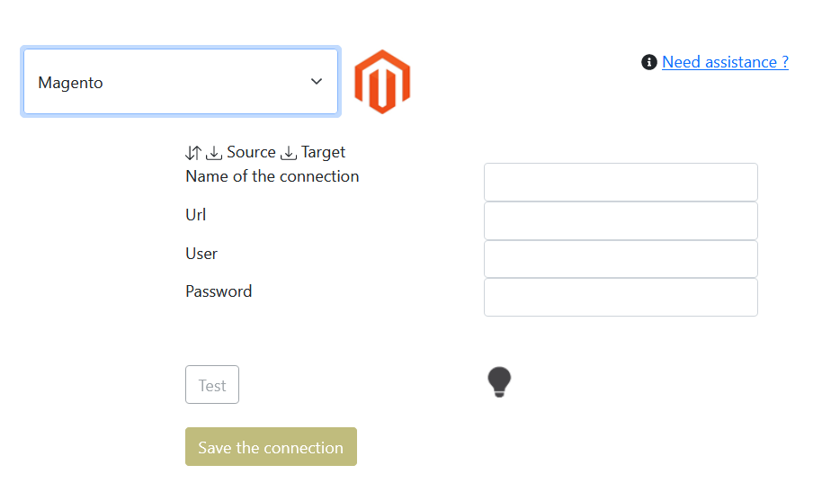

### Prestashop

Every module can be read by Myddleware as a source & target.

It will allow you to create the PrestaShop connector.

To do so, you will need : 

- your shop's URL
- an API key which you will have to generate yourself

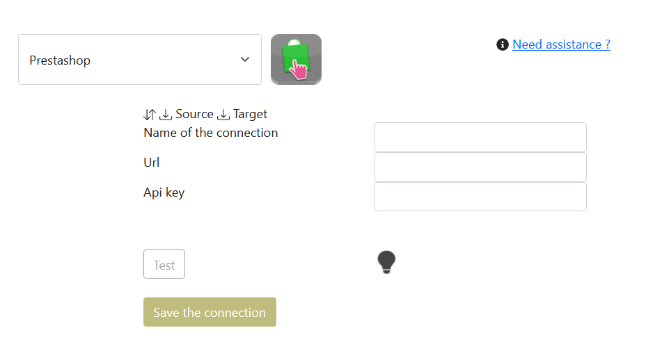

#### How do you generate your API key?

To generate this key, you should go in the back office of your shop. Go to ``Advanced Settings`` and then ``Webservice``.
Click on “enable webservice” (save if the webservice was not activated) then click on “Add new webservice key” (black arrow)
Finally, click on “generate” to generate the key and set the “Status” button to “Yes”. 

Select the checkboxes “View”, “Edit”, “Add” and “Fast view” (just like in the example below).

Finally, save and get your API key to create your connector.

### WooCommerce (WordPress)

In order to link your WooCommerce shop to Myddleware, you need to provide the following information :

- your shop's URL
- your Consumer Key
- your Consumer Secret

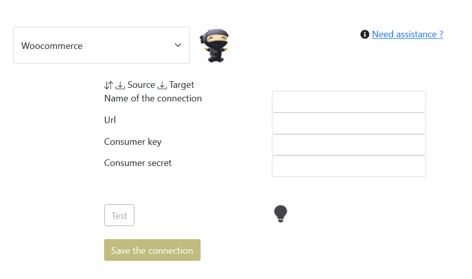

#### Where to generate your Consumer Secret & Consumer Key?

Login to your WordPress admin interface. Then, go to the WooCommerce section.
Select ``Settings``, then ``Advanced``, then click on ``REST API``.

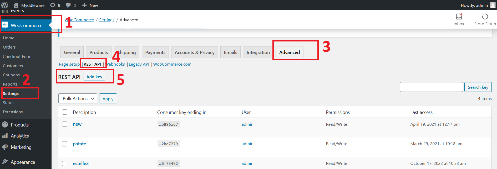

Then, fill in the form by selecting the appropriate user, and select Read/Write permissions to allow Myddleware to both read & write into your application.

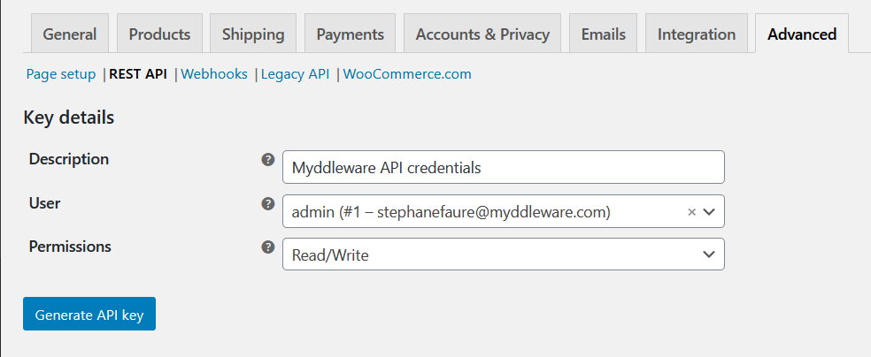

When submitting the form, your credentials will be displayed. Make sure to copy them down as they will only be displayed once, you won't be able to access them anymore later.

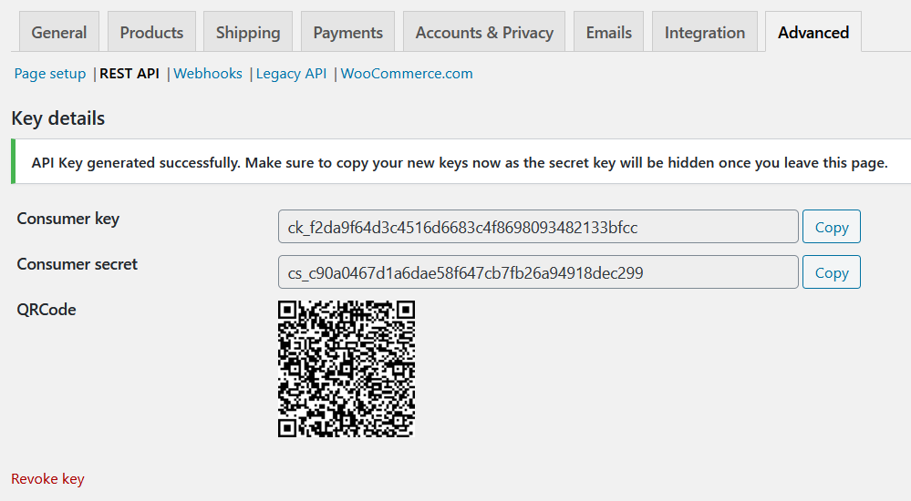

### Shop Application

Myddleware can write all Shop Application modules and read the module customer.

To connect Shop application to Myddleware, you need these parameters :

- URL of your shop application
- API key. Ask the shop application team to give it to you.

## E-marketing platforms

### Dolist

Here is the list of available modules in source (reading) and target (writing) :

| Module                     | Source | Target |
|----------------------------|--------|-------|
| Campaign                   | Yes    | No    |
| Contacts                   | Yes    | Yes   |
| Body segment statistics    | No     | Yes   |
| Header segment statistics  | No     | Yes   |
| Finished statistics        | Yes    | No    |
| Clicks statistics          | Yes    | No    |
| Unsubscribed statistics    | Yes    | No    |
| Unfinished statistics      | Yes    | No    |
| Open statistics            | Yes    | No    |

– Connecting to your Dolist environment
– Creating a Dolist authentication
– Retrieving the information needed to create the connector in Myddleware.

1st step: Connect to your Dolist environment:

Go to your Dolist login portal and log in.

Once you are logged in, you will be redirected to the home page. Click on the administration tab as shown in the image below :

The administration tab is now open. You will find in the left menu a subsection named “Web Services”. Click on it.

The following tabs should appear. The one which interests us is “key management”.

You are now ready to move to the second step.

2nd step: Creating a Dolist authentication

While you are on the “manage keys” tab, click on “Add a new Authentication”

You must now fill in the necessary fields. We advise you not to choose the restriction by IP and to check the “permanent validity”. If you however wish to add Myddleware IP to your restrictions, please contact us.

Congratulations, you’ve just created your Dolist authentication for Myddleware !

3rd Step: Retrieving the necessary information

For this last step, just click on the “See Key” button or the “See the authentication key” button, if you are still on of your authentication page.

Enter your logins to display the following information:

Take note of your Account ID and your authentication key so that you can fill in the fields when creating your Dolist connector in Myddleware.

### Mailchimp

Here is the list of available modules in source (reading) and target (writing) :

| Module                           | Source | Target  |
|----------------------------------|--------|---------|
| Campaigns                        | No     | Yes     |
| Lists                            | No     | Yes     |
| List members                     | No     | Yes     |

Log in to Mailchimp and open your profile page.

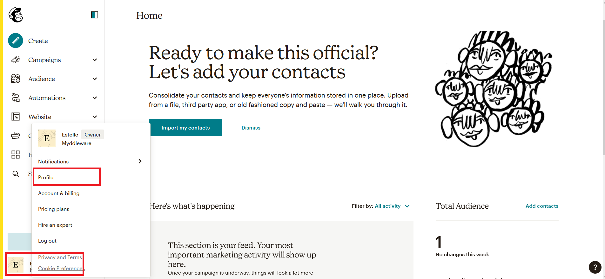

Then, click on ``Extras`` > ``API Keys`` and get your API key from there :

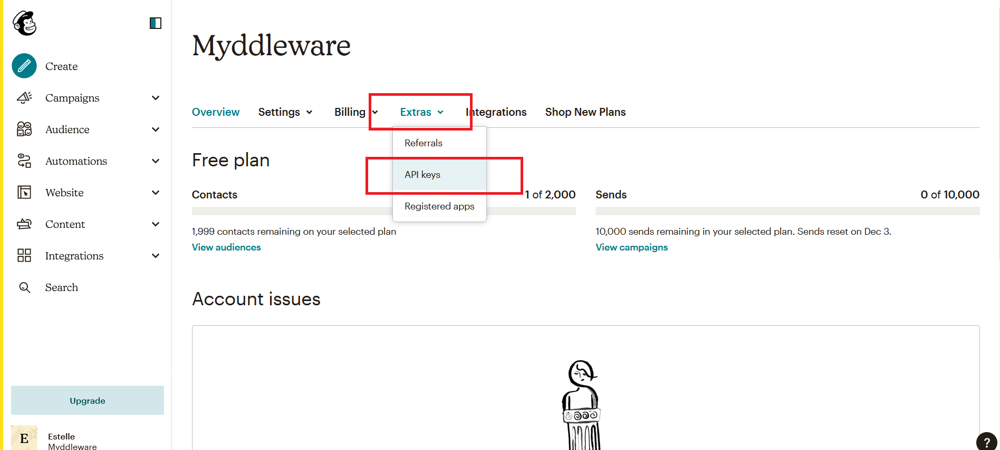

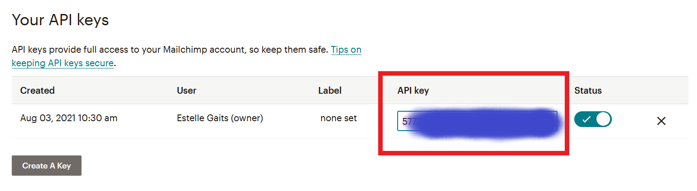

Finally, add this key in your Myddleware connector :

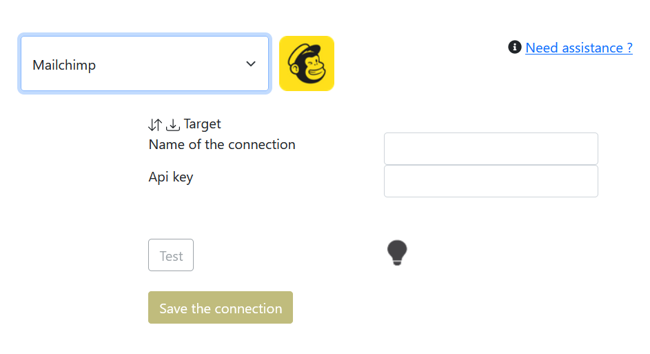

### Mautic 

Here is the list of available modules in source (reading) and target (writing) :

| Module   | Source | Target |
|----------|--------|--------|
| Company  | No     | Yes    |
| Contacts | No     | Yes    |

To connect Mautic to Myddleware, you need :

- your username
- your password
- your URL

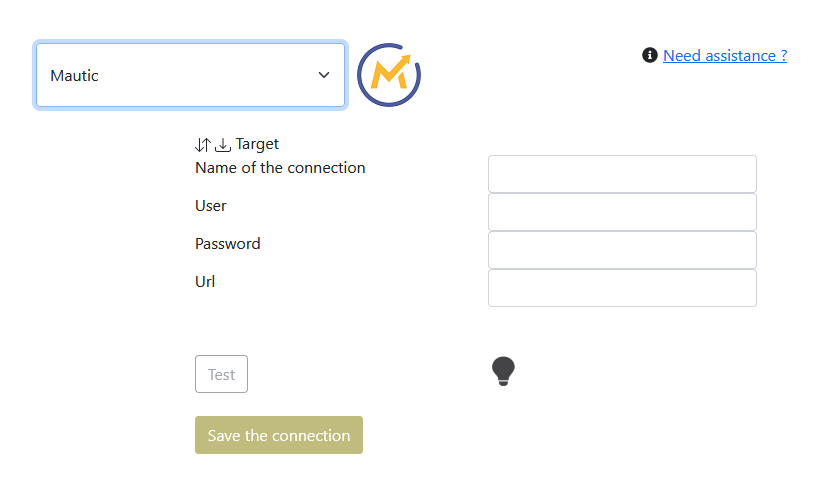

### Sendinblue

Myddleware is able to read the following modules :

| Module                        | Source | Target |
|-------------------------------|--------|--------|
| Contacts                      | Yes    | Yes    |
| Transactional emails          | Yes    | Yes    |
| Transactional email activity  | Yes    | Yes    |

To create a Sendinblue connector, you need to provide the following information:

- login (your email address)
- API key 

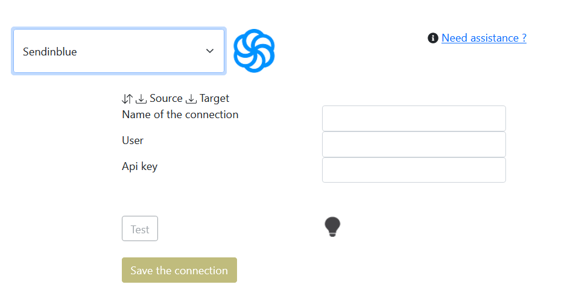

#### Where to find your API key?

You can get your Sendinblue API key by going to the user menu, then go to ``SMTP & API`` or directly to https://account.sendinblue.com/advanced/api.

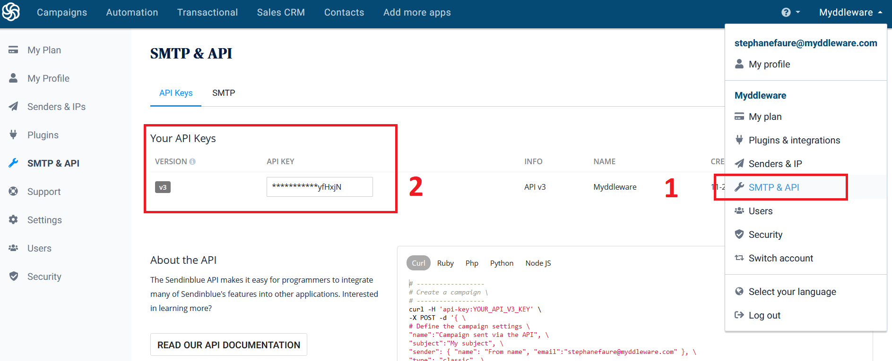

## Database apps

### Microsoft SQL Server

Myddleware can write and read all tables of your Microsoft SQL database.

To connect a Microsoft SQL database to Myddleware, you need these parameters :

- User
- Password 
- Host server 
- Database name 
- Database port access

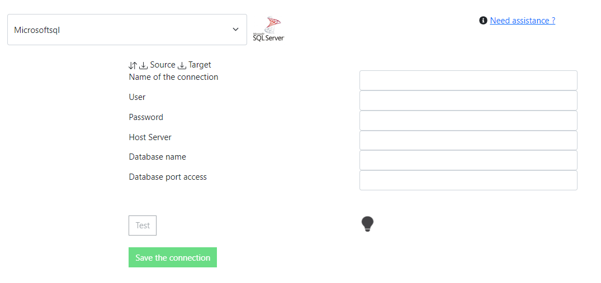

You need to enable the PDO php module. This page should help you do so : [Installing/Configuring PDO](https://www.php.net/manual/en/pdo.installation.php)

If you installed Myddleware on a Windows server, you need to install the [sqlsrv PDO driver](https://www.php.net/manual/en/sqlsrv.installation.php).

If you installed Myddleware on a Linux server, you need to install the [dblib PDO driver](https://www.php.net/manual/en/ref.pdo-dblib.php).

### MySQL

Myddleware can write and read all table of your MySQL database.

To connect a MySQL database to Myddleware, you need these parameters :

- User 
- Password 
- Host server 
- Database name 
- Database port access

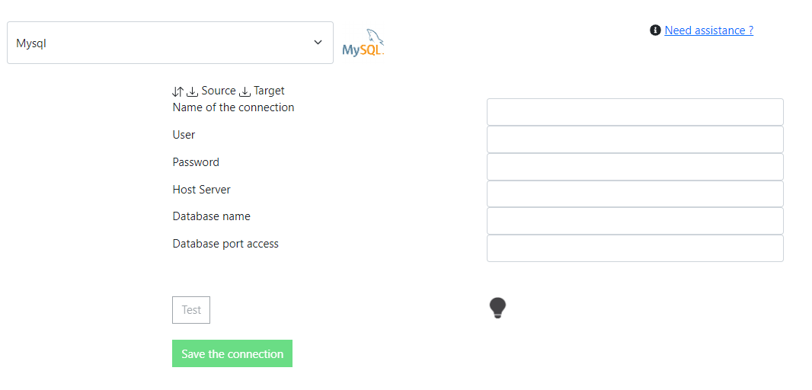

Myddleware uses the MySQL PDO driver.

You need to enable the PDO PHP module. 
This manual should help you : [Installing/Configuring PDO](https://www.php.net/manual/en/pdo.installation.php)

### Oracle

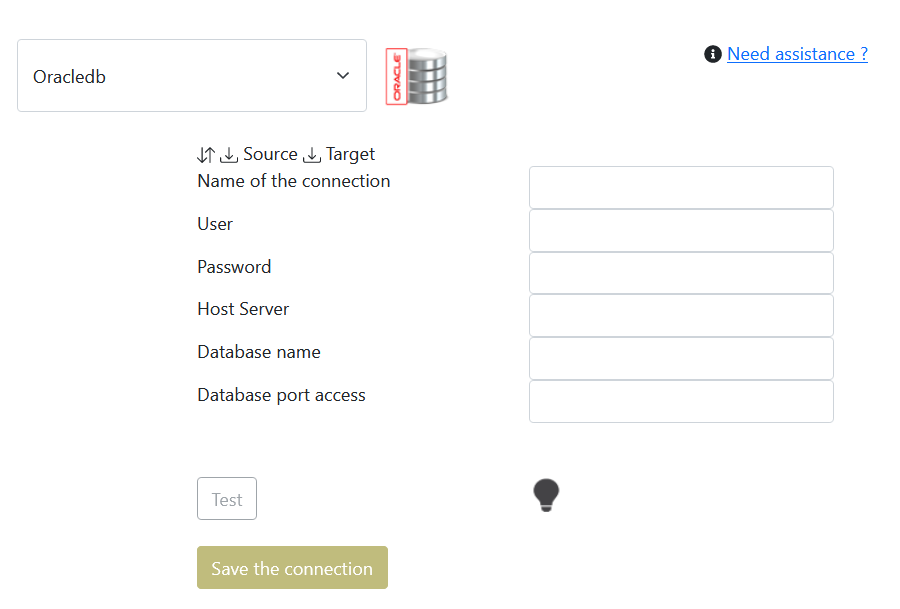

### PostgreSQL

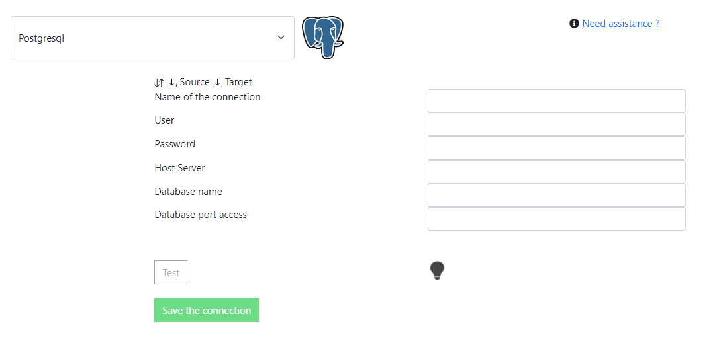

## Others

### Eventbrite

- 'Organizer' => 'User
- 'Events' => 'User
- 'Tickets' => 'User
- 'Venues' => 'User
- 'Access_Codes' => 'Event
- 'Discount_Codes' => 'Event
- 'Attendees' => 'Event
- 'Users' => 'User

### Facebook

Here is the list of available modules in source (reading) and target (writing) :

| Module                  | Source | Target |
|-------------------------|--------|--------|
| Read capture lead form  | Yes    | No     |

To connect a Facebook to Myddleware, you need these parameters :

- Client ID 
- Client secret 
- User access token

You will find your client ID and client secret in your app. 
You will find your app here, You will be able to create an app if you don’t have one. https://developers.facebook.com/apps/

To get you access token, open the Graph API Explorer : https://developers.facebook.com/tools/explorer

Select your app, user token and add autorisations : ``manage_page`` and ``leads_retrieval`` :

Then, copy your token. However, this token will expire in a few hours. 
If you want to extend the life of this token, click on the ``i`` icon  :
Then click on ``Open in Access Token Tool`` :
Then click on ``Extend Access Token``. 
Your token will expire in 2 month. After this time you will have to refresh the token in your Myddleware Facebook connector.

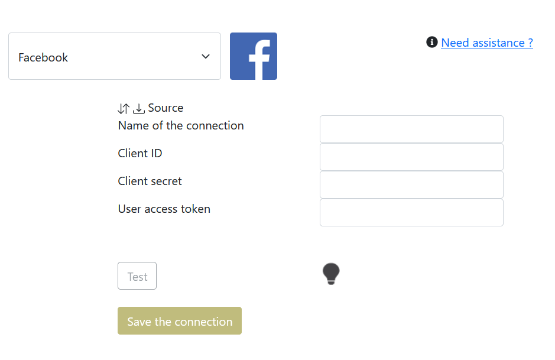

### File (FTP)

Myddleware can be connected to your server via an FTP connection. 
It can read csv/txt files stored on your server and transfer the data to another application.

To connect Myddleware to an FTP server, you need these parameters :

- User 
- Password 
- Host server 
- Port 
- Directory where the files will be stored (eg : ``/home/myddleware/my_directory``)

Myddleware uses the  [ssh2_connect()](https://www.php.net/manual/en/function.ssh2-connect.php) 
and [ssh2_auth_password()](https://www.php.net/manual/en/function.ssh2-auth-password.php) PHP functions to connect to your FTP server.

### Moodle
#### Module list

Here is the list of available modules in source (reading) and target (writing) :

| Module                         | Source | Target |
|--------------------------------|--------|--------|
| Courses                        | Yes    | Yes    |
| Users                          | Yes    | Yes    |
| Group members                  | No     | Yes    |
| Groups                         | No     | Yes    |
| Enrollment                     | Yes    | Yes    |
| Unenrollment                   | No     | Yes    |
| Notes                          | No     | Yes    |
| Courses completion             | Yes    | No     |
| Activities completion          | Yes    | No     |
| Courses last access            | Yes    | No     |
| Competencies module completion | Yes    | No     |
| User competencies              | Yes    | No     |
| User grades                    | Yes    | No     |

#### Install the plugin Myddleware in Moodle. 

<video src="file/tuto_moodle_new.mp4" width="800"  controls></video>

Go to the administration of the site and then ``Plugins`` and ``Install plugins``

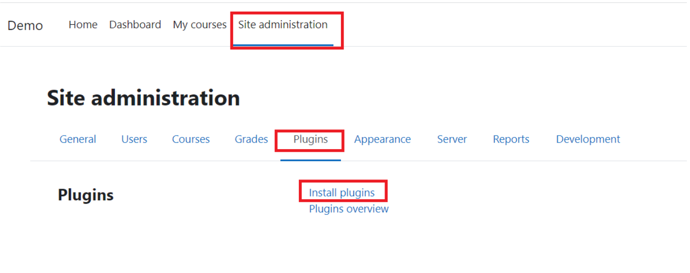

Then you can choose to install it from Moodle plugins directory if you Moodle instance is registered or you can install it from the archive that you can [download it here](https://moodle.org/plugins/local_myddleware)

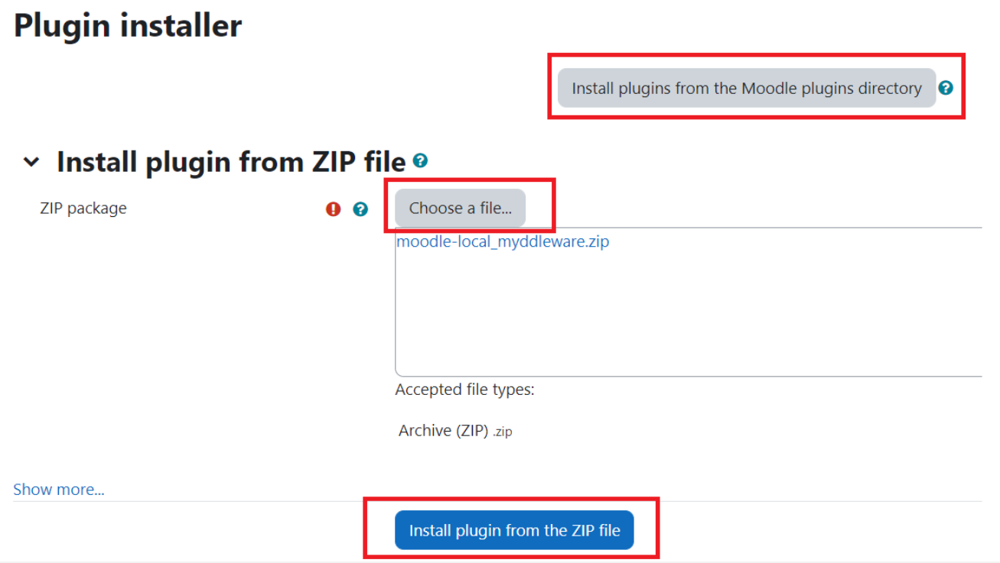

> This plugin contains several custom webservice functions required by Myddleware. 

Then click on ``Continue`` :  

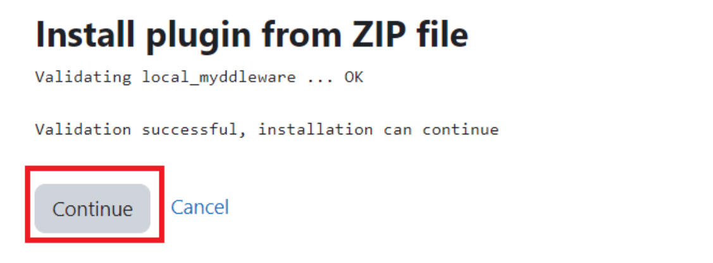

Click again on ``Continue`` :  

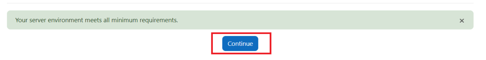

Then click on ``Upgrade Moodle database now`` :  

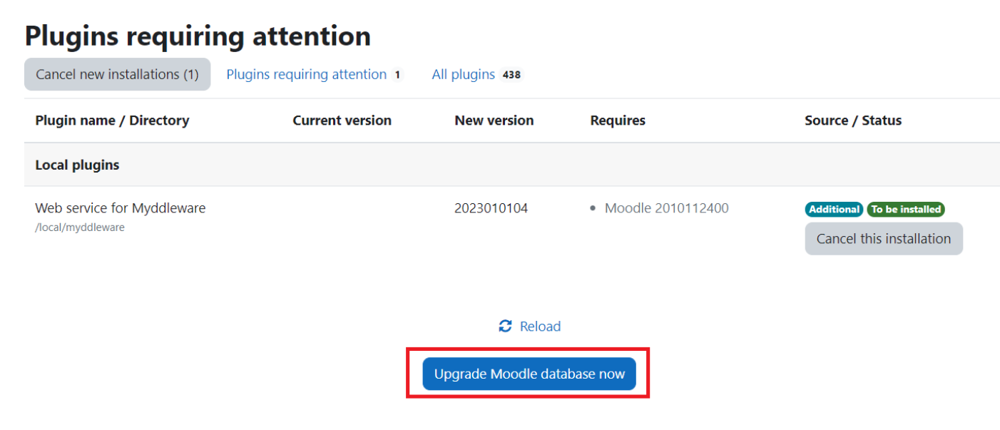

Then click on ``Continue`` :  

#### Enable web services

Go to ``Site administration`` and then ``Server Web services`` and ``Overview``

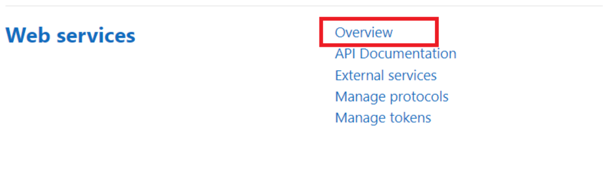

In the overview page, click on ``Enable web services`` and check the box :  

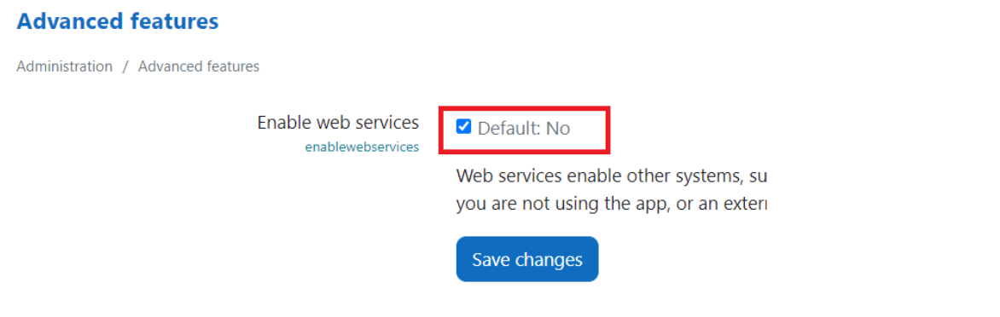

In the overview page, click on ``Enable protocols`` and enable the REST one : 

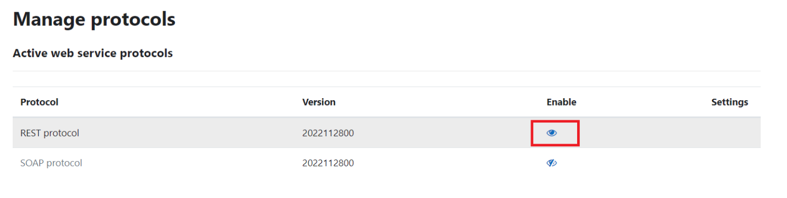

In the overview, you should have ``Yes`` and ``REST``, then click on ``Create a specific user`` to create a user for Myddleware :

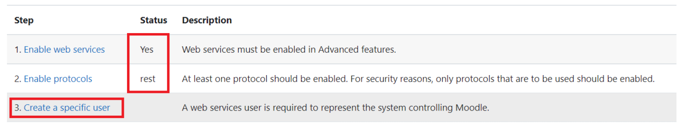

#### Create user and role 

Create a new user, click on ``Site administration`` and then  ``Users`` and ``Add new user``

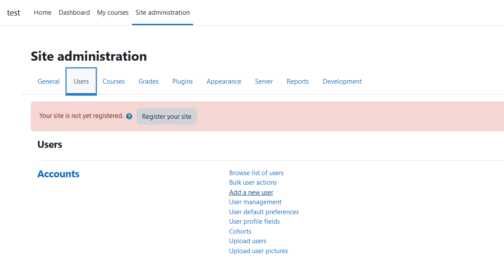

> Create the user that the web service will use, set an username, first name, surname, email address and set web service authentication. No need to set a password : 

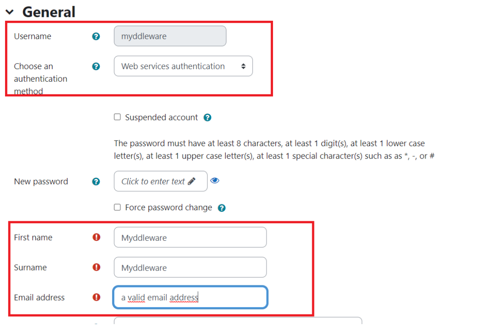

Then import Myddleware’ s role in Go to ``Site administration`` -> ``Users`` -> ``Permissions`` -> ``Define roles`` :  


Then click on ``Add a new role`` :  


Download Myddleware’s role <a href="file/myddleware_moodle_role_1.4.xml" download>here</a>. 

Add the xml file here and click on ``Continue``:  


Then go to the bottom of the page and click on ``Create this role`` :  


Assign this role to the user you have created. Go to ``Site administration`` -> ``Users`` -> ``Permissions`` -> ``Assign system roles``


> Click on ``Myddleware`` :  


Then select Myddleware ‘s user and add it to the left column :  


#### Authorised users

Go to Site administration -> Server -> Web services -> External services 


Click on ``Authorised users`` :  


Then select Myddleware‘s user and add it to the left column :  


> You shouldn’t have any missing capacity at the bottom of the page. 

Go to Site administration -> Server -> Web services -> Manage tokens 


Select Myddleware ‘s user and Myddleware service, then click on Save Changes :  


Then copy your token :  


#### Generate Moodle’s token 

Finally, you can create your Moodle Myddleware connector by filling in your Moodle URL and your token : 


#### Synchronize data between Prestashop and Moodle using Myddleware

<video src="file/moodle_prestashop.mp4" width="800"  controls></video>

#### Synchronize data between Salesforce and Moodle using Myddleware

<video src="file/tuto_moodle_salesforce.mp4" width="800"  controls></video>

### RingCentral

Here is the list of available modules in source (reading) and target (writing) :

| Module    | Source | Target |
|-----------|--------|--------|
| Call log  | Yes    | No     |
| Messages  | Yes    | No     |
| Presence  | No     | No     |

To create your RingCentral connector, you will need :

- Username 
- Password 
- API key 
- API secret

Click [here](https://devcommunity.ringcentral.com/ringcentraldev/topics/how-do-i-get-my-production-app-key) to get more 
information about these parameters.


### Sage50

Myddleware can read and write all Sage50 module available with Sage Sdata API

To create your Sage50 connector, you will need the following :

- Username
- Password
- Host server

Don’t forget to activate your Sage50 Sdata API :

### WooCommerce Event Manager Plugin (WordPress)

This WordPress plugin is provided by [MagePeople](https://mage-people.com/product/mage-woo-event-booking-manager-pro/).
This connector relies on the WordPress connector.
The list of available modules is based on this [documentation](https://docs.mage-people.com/woocommerce-event-manager/rest-api-details-of-event-manager/).
Currently, Myddleware is able to read the following modules :

| Module           | Source | Target |
|------------------|--------|--------|
| Events           | Yes    | No     |
| Categories       | Yes    | No     |
| Organizers       | Yes    | No     |
| Event More Date  | Yes    | No     |


### Zuora

Myddleware can read and write in all Zuora modules.

To create a Zuora connector, you will need:

- Your username 
- Your password 
- WSDL file that you need to download. You will find more information about WSDL [here](https://knowledgecenter.zuora.com/DC_Developers/G_SOAP_API/AB_Getting_started_with_the__SOAP_API/B_Zuora_WSDL) 
- Finally, if you're connecting to a sandbox, please write ``1`` or ``0`` if you're connecting a production environment


