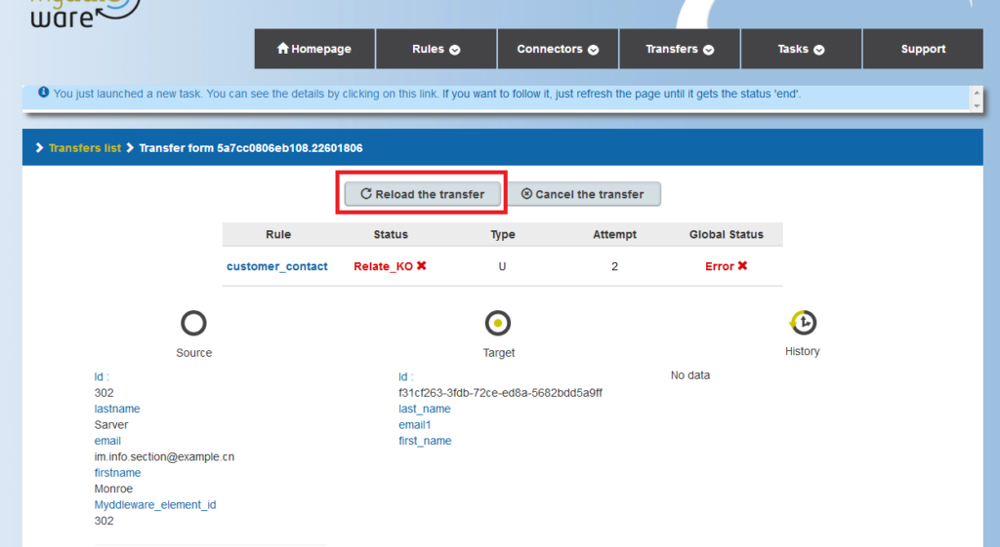
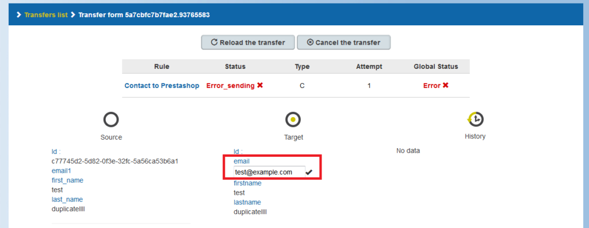
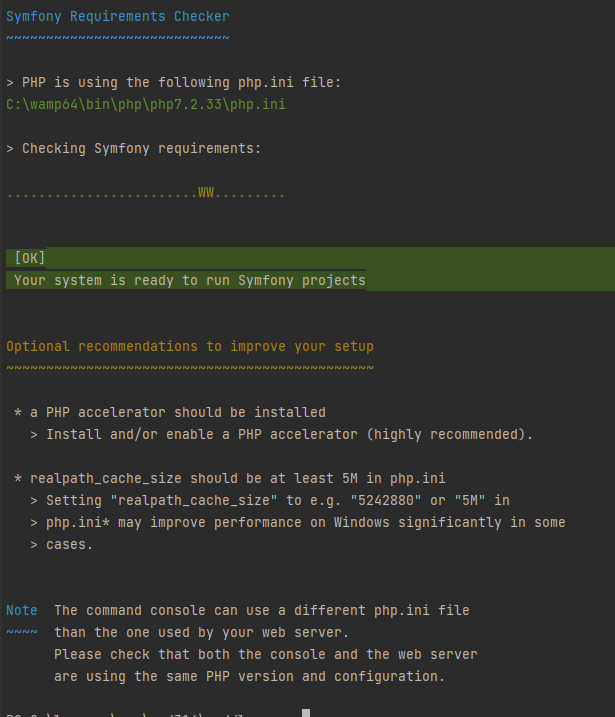
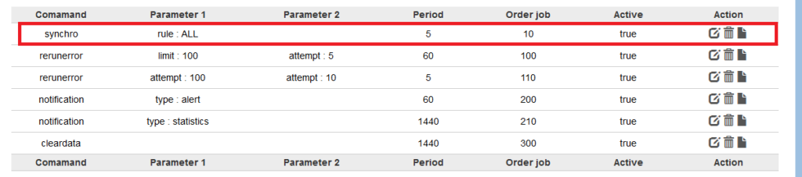
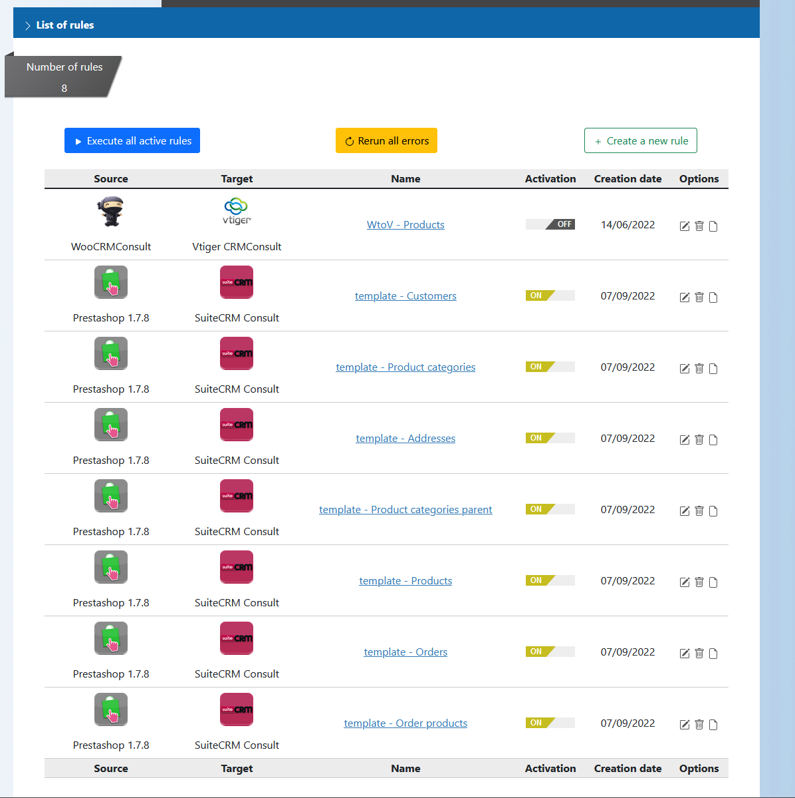
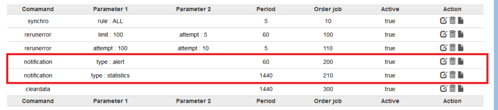
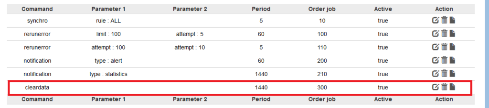
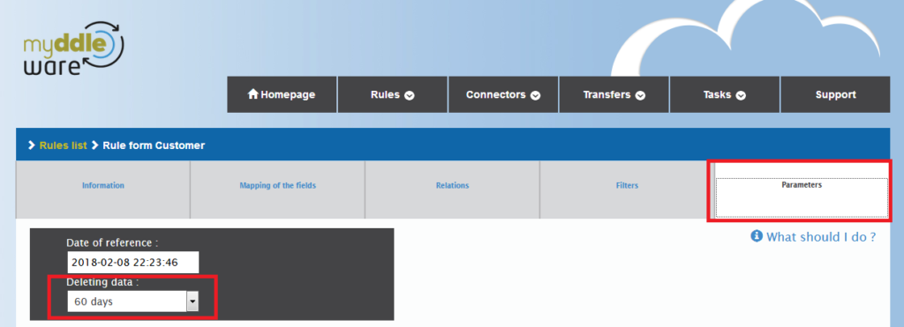
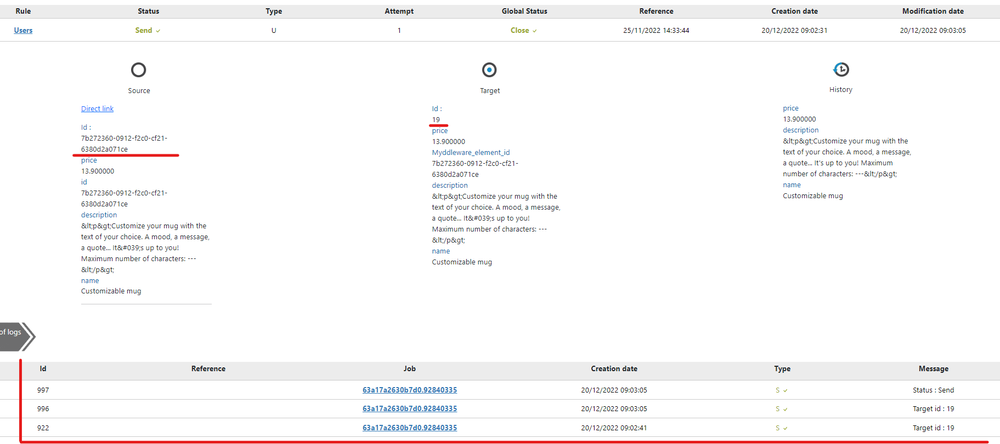

# Automations : cron tasks & job scheduler

## Handling transfers in error

Data transfers (also called documents) can be rejected for different reasons :

- The target application isn’t available (e.g. server error)
- Invalid data from the source application (e.g. invalid email format)
- A related document was also rejected, a queue has therefore been created

A rejected data transfer can be automatically reloaded using the **rerunerror** job (see *Scheduled tasks*). 
It can also be manually reloaded by clicking on «Reload» :



It is also possible to cancel a data transfer.

Finally, you can modify a document in Myddleware by clicking on the field containing the invalid data. 
However, it is always recommended to modify invalid data directly from within your source application.



Then, you can reload the document to send it to your target application.

## Schedule tasks using the job scheduler

Myddleware can work with background tasks to sync your data, send notifications, clean data, and more.

If you wish to carry out any of these actions, you will need to set up a background task using the crontab for Linux, or Windows' task scheduler.

Before creating this task, you need to make sure your configuration is right. Open a command shell and run the following command in the root directory of your Myddleware instance:

```bash
symfony check:requirements
```


From there, unless everything is OK, follow the instructions returned from the command line. There could potentially be a missing PHP extension or
file permissions to be updated. 


Now, all you need to do is set up the “jobScheduler” scheduled task that will launch all the other Myddleware tasks:

```bash
php bin/console myddleware:jobScheduler --env=background
```

This jobScheduler task will read the JobScheduler table and start the tasks according to the parameters of this table. You can manage this table directly from Myddleware

### Setting up your  own scheduled tasks directly from the Myddleware interface

On your Myddleware interface you can create your own scheduled tasks. To access the page where you can do this, click on your username at the
top and select  ```jobscheduler``` :


Here, you will find a list of all your scheduled tasks, including Myddleware's default tasks (see **Default Myddleware background jobs** below),
with the possibility to modify or delete a task via the **Action** column.


To create a new task, click the **New command** button. You will then be redirected to the command creation page:


Here, you will first have to select the type of command you want to create, depending on your choice there will be different parameters to fill in.

We would like to particularly draw your attention to the following columns:

| Column name | Description                                                                                                                                                                                      | 
|-------------|--------------------------------------------------------------------------------------------------------------------------------------------------------------------------------------------------|
| Period      | time interval corresponding to the frequency of execution of this task. Caution: The frequency of the scheduled task must be greater than or equal to the frequency entered in the period field. |
| Job order   | order in which the tasks will be executed. The tasks with the smallest order will be executed first.                                                                                             |
| Active      | allows you to enable/disable a scheduled task.                                                                                                                                                   |

We will detail the different tasks in the following chapters that will enable you to fill the other columns.

### Setting up a crontab inside the Myddleware interface

Just like with the job scheduler, you can use crontab to schedule tasks directly via Myddleware. To do so, click again on your username, then click on ```Crontab```.


| Column name      | Description                                                                                                                                                                                                                                                                                                                                                                       | 
|------------------|-----------------------------------------------------------------------------------------------------------------------------------------------------------------------------------------------------------------------------------------------------------------------------------------------------------------------------------------------------------------------------------|
| Command          | your command's name                                                                                                                                                                                                                                                                                                                                                               |
| Period           | just like the job scheduler, period is a time interval corresponding to the when your task will be executed. <br/> Here on the other hand the syntax to use is very precise. <br/> Example : */5* ** * <br/> in order of writing:  minute(0-59), hour (0-23), day of the month(1-31), month(1-12), day of the week(0-6) (Sunday to Saturday => 7 is also Sunday on some systems). |
| Arguments        |                                                                                                                                                                                                                                                                                                                                                                                   |
| Description      |                                                                                                                                                                                                                                                                                                                                                                                   |
| Running instance |                                                                                                                                                                                                                                                                                                                                                                                   |
| Max instance     |                                                                                                                                                                                                                                                                                                                                                                                   |
| Number           |                                                                                                                                                                                                                                                                                                                                                                                   |

Here you will find a table with all your periodic tasks, to create a new command click on the ```Create crontab``` button


To help you generate your own crontabs with the appropriate syntax, you can use either of the following tools : 

- [Crontab guru](https://crontab.guru/) 
- [Crontab Generator](https://crontab-generator.org/)

For further info & help about crontabs, we suggest you check out [this tutorial by Hostinger](https://www.hostinger.com/tutorials/cron-job) and the [shapecode/cron-bundle](https://github.com/shapecode/cron-bundle) Github repository, which is the bundle we used to create our cron task scheduler.


## Default Myddleware background jobs

### Data Synchronization

The ```synchro``` program will allow you to synchronize your data by either executing a specific rule or all active rules at the same time :



| Command | Parameter 1                                   |
|---------|-----------------------------------------------|
| synchro | Select all active rules or a specific rule.   |

Only active rules will be available in the list:



### Reloading errors

The ````rerunerror```` scheduled task reloads transfers in error automatically.


| Command | Parameter 1                                                          | Parameter 2                                             |
|---------|----------------------------------------------------------------------|---------------------------------------------------------|
| rerunerror | the maximum number of documents that the job will attempt to reload. | the maximum number of times a document will be reloaded |

In the above example, we have configured 2 tasks which will attempt to reload documents in error:

- The first takes 100 maximum data transfers once per hour (60 minutes). This job will only take data transfers that have been reloaded at most 5 times. 
- The second takes 100 data transfers maximum once a day (1440 minutes). This job will only take data transfers that have been reloaded a maximum of 10 times.


### Error notifications

The ```notification``` scheduled task allows you to send notifications and alerts or statistics via email.



| Command | Parameter 1                                                                                                                                                                                                                                                |
|---------|------------------------------------------------------------------------------------------------------------------------------------------------------------------------------------------------------------------------------------------------------------|
| notification | ```alert``` or ```statistics```<br/> If *alert* then the program will send an alert when a scheduled task has been stopped. <br/>If *statistics*, the program will send statistics (number of documents in error, number of documents successfully sent,…) |


In the above example, we have configured 2 tasks :

- Every hour, the first task checks whether a scheduled task is blocked. If yes, an email is sent to all your administrators.
- The second one sends statistics every day.

In order for these tasks to run, please make sure you have configured your SMTP parameters (checkout the [**Email notifications configuration**] section(smtp.md)).

### Data clearing

The ```cleardata``` scheduled task deletes all the empty or expired data in Myddleware.



In the above example, we have configured a task that deletes empty or expired data in Myddleware :

- Empty data corresponds to either of the following :
  - data transfer logs that carry no important information (all logs except error, new and sent log) and which are 7 days or older 
  - tasks that have not performed any data transfer and are 7 days or older
- Expired data corresponds to the documents that have exceeded their expiry date set from inside the rule parameters tab.



Once the data has been cleared up, all that remains are the documents' IDs and important logs (document creation, sending and possible errors) :



## What to do in case of Myddleware shutdown ?

On some occasions, Myddleware might be interrupted while it is running. For instance, your web server might shut down unexpectedly, or your http service (Apache for example) or MySQL might encounter a problem. 
Here’s how to make sure that Myddleware restarts properly once your server is restarted.

First, you need to check whether Myddleware had a job in progress when the interruption occurred. To do so, click on the tasks list inside the Myddleware interface and check whether a task is still running.
Then check whether its start date is before the interruption:


If so, click on the task and then click on the 'stop task' button at the top. Indeed, this task will never stop automatically and will block Myddleware's correct execution until you've stopped it manually.


Once the task has been stopped, it will no longer block Myddleware, which will now resume to its usual behaviour.