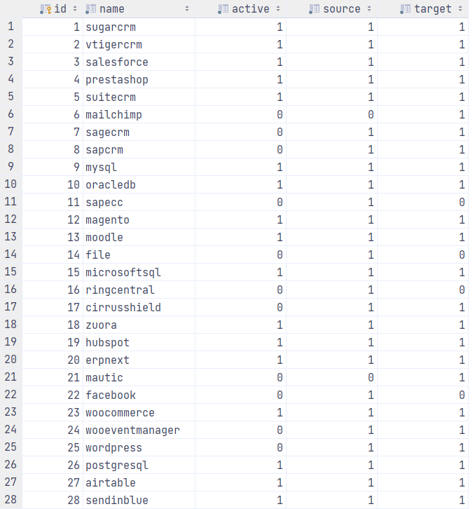
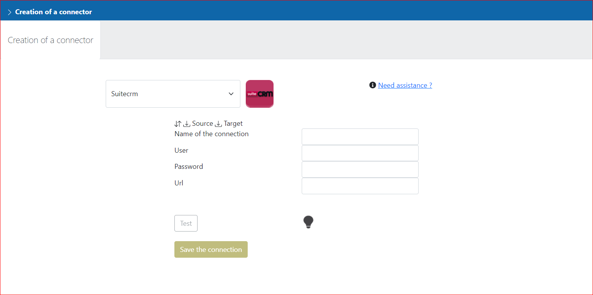
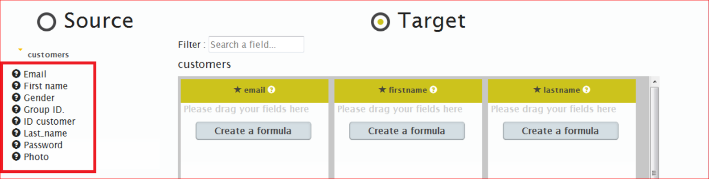
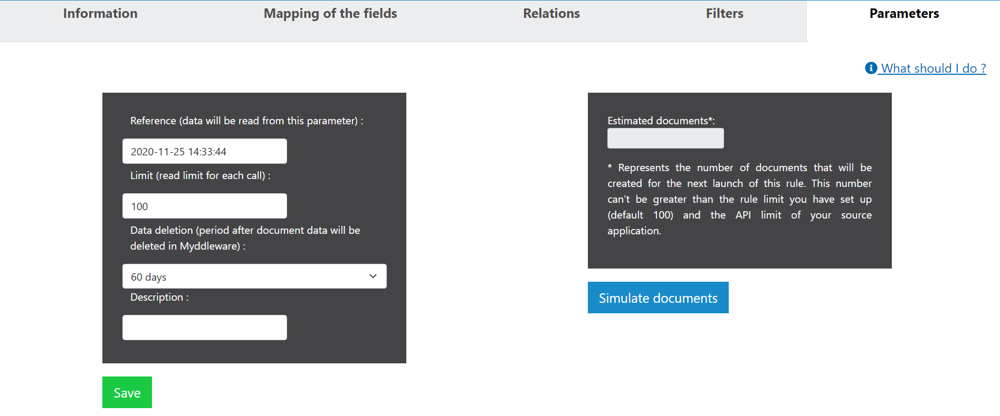
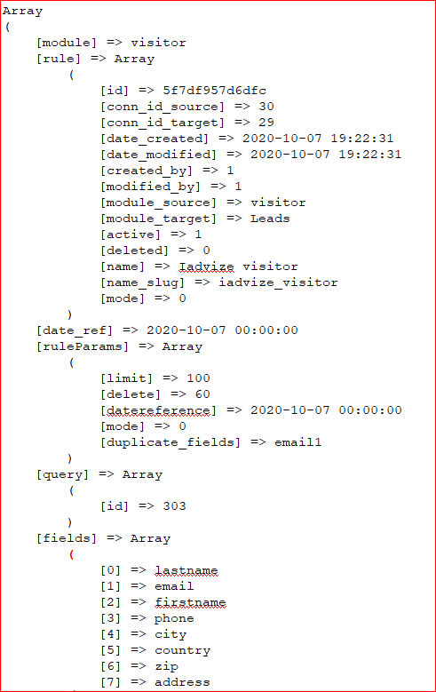
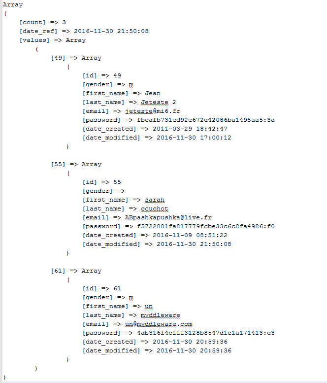
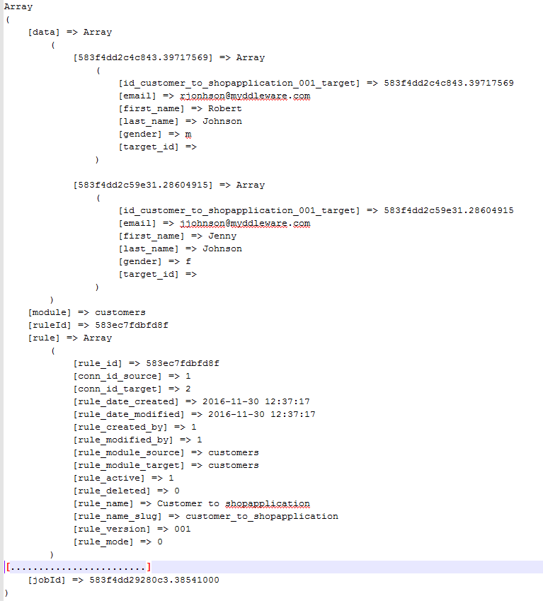

# Developer's guide

All Myddleware improvements are welcome, and we particularly encourage community members to contribute to our connectors list by making a pull request so that the whole community can benefit from your work.
To help you write your own connector, please read the following guidelines for successful connector creation.
We also strongly recommend checking out the source code of all existing connectors inside the [/src/Solutions folder](https://github.com/Myddleware/myddleware/blob/main/src/Solutions/) to help you implementing all the required methods.

!>You may also have some very specific needs that simply require customising Myddleware to fit your own context. If that's the case, please refer to the "Ensuring your custom code is upgrade-safe in Myddleware" section of this documentation.

## Create your own connectors

### Requirements

Before you can connect a new application to Myddleware, you need to check that the application you want to connect has a webservice API with methods to read data (at the very least) 
and hopefully has a documentation website available to help you connect Myddleware to the target application. 

> Most Myddleware applications are connected using REST API, however this is not the only option.

#### Declare your new connector's name

First you will need to add your new connector to the ``solution`` table in your database, using Doctrine Fixtures,
and more specifically the ``LoadSolutionData`` class, located in
[/src/DataFixtures/LoadSolutionData.php](https://github.com/Myddleware/myddleware/blob/main/src/DataFixtures/LoadSolutionData.php). 
To do so, add a new entry in ``$solutionData`` in  for your new connector :

```php
    protected $solutionData = [
            ['name' => 'sugarcrm',   'active' => 1, 'source' => 1, 'target' => 1],
            ['name' => 'vtigercrm',   'active' => 1, 'source' => 1, 'target' => 1],
            ['name' => 'salesforce',  'active' => 1, 'source' => 1, 'target' => 1],
            ['name' => 'prestashop',  'active' => 1, 'source' => 1, 'target' => 1],
            // Your connector
            ['name' => 'myconnector',  'active' => 1, 'source' => 1, 'target' => 1],
    ];
```

In [/src/Manager/SolutionManager.php](https://github.com/Myddleware/myddleware/blob/main/src/Manager/SolutionManager.php), add your new connector to the ``SolutionManager`` class.

First, add the use statement at the top of the SolutionManager class :

```php
    use App\Solutions\WooEventManager;
    use App\Solutions\WordPress;
    use App\Solutions\Zuora;
    // Your new connector
    use App\Solutions\MyConnector;
```

Then still in ``SolutionManager``, add the new connector to the constructor.

```php
    public function __construct(
        WordPress $wordPress,
        WooCommerce $wooCommerce,
        WooEventManager $wooEventManager,
         // Your connector
         MyConnector $myConnector
    ) {
        $this->classes = [
            'wordpress' => $wordPress,
            'wooeventmanager' => $wooEventManager,
            'woocommerce' => $wooCommerce,
             // Your connector
            'myconnector' => $myConnector
        ];
    }
```

#### Download source API SDKs (optional)

!> This step is optional and will vary according to the type of API you would like to connect to Myddleware. For this part, you must refer to the source API documentation.

In your terminal, you might need to download an SDK for the new API. 
For instance, [the WooCommerce REST API documentation](https://woocommerce.github.io/woocommerce-rest-api-docs/#introduction)
tells us that we need to add the **automattic/woocommerce** dependency to our Myddleware project in order to be able to login to the REST API. To do so, we ran :

```bash
       composer require automattic/woocommerce
```

Then, we implemented the Client described in their documentation inside our login(), create(), update() & read() methods. 
Here is a sample of the code using the third-party client:

````php
<?php

namespace App\Solutions;

use Automattic\WooCommerce\Client;

...

class woocommercecore extends solution
{
    protected $apiUrlSuffix = '/wp-json/wc/v3/';
    protected $url;
    protected $consumerKey;
    protected $consumerSecret;
    protected $woocommerce;
    
    ...
    
    public function login($paramConnexion)
    {
        parent::login($paramConnexion);
        $this->woocommerce = new Client(
            $this->paramConnexion['url'],
            $this->paramConnexion['consumerkey'],
            $this->paramConnexion['consumersecret'],
            [
                'wp_api' => true,
                'version' => 'wc/v3',
            ]
            );
        if ($this->woocommerce->get('data')) {
            $this->connexion_valide = true;
        }
    }
}

    public function upsert($method, $param)
    {
        ...
        foreach ($param['data'] as $idDoc => $data) {
                $param['method'] = $method;
                $module = $param['module'];
                $data = $this->checkDataBeforeCreate($param, $data, $idDoc);

                if ('create' === $method) {
                    unset($data['target_id']);
                    $recordResult = $this->woocommerce->post($module, $data);
                } else {
                    $targetId = $data['target_id'];
                    unset($data['target_id']);
                    $recordResult = $this->woocommerce->put($module.'/'.$targetId, $data);
                }          
            ...
        }
    }
    
    public function read($param){
    ...
        $response = $this->woocommerce->get($module, [
            'orderby' => 'modified',
            'per_page' => $this->callLimit,
            'page' => $page, ]
        );
    ...        
    }
    ...
````

### Add the new connector to your current database

In your terminal, load Myddleware fixtures. This will store your new connector's name inside the database.

```bash
        php bin/console doctrine:fixtures:load --append
```
Your new connector should appear inside the ``solution`` table of your database



> Go to your Myddleware interface to check whether the new connector is already available.

### Creating the Connector file

Now, let's create a new solution(connector) class, in [/src/Solutions](https://github.com/Myddleware/myddleware/tree/main/src/Solutions). 
The file name must be the same as the name of your class (this is due to autoloading). 

!> All Connectors (Solutions) extend the Myddleware parent class ```Solution```. This class contains a variety of methods which you may override to fit your connector's needs. 
We strongly recommend you [check it out](https://github.com/Myddleware/myddleware/blob/main/src/Solutions/solution.php) when in doubt as this class acts as the backbone of all Myddleware connectors.

You can use the code of another class for inspiration. For example, check out [SuiteCRM.php](https://github.com/Myddleware/myddleware/tree/main/src/Solutions/suitecrm.php):

```php
        namespace App\Solutions;

        use Symfony\Component\Form\Extension\Core\Type\PasswordType;
        use Symfony\Component\Form\Extension\Core\Type\TextType;

        class SuiteCRM extends Solution
        {
        protected $limitCall = 100;
        protected $urlSuffix = '/service/v4_1/rest.php';
        // Enable to read deletion and to delete data
        protected $readDeletion = true;
        protected $sendDeletion = true;

        protected $required_fields = ['default' => ['id', 'date_modified', 'date_entered']];
        
        ...
        }
```

#### Add the solution's logo

Finally, if you want to display the application's logo, add the image corresponding to your application with the png format and size 64*64 pixels in [assets/images/solution](https://github.com/Myddleware/myddleware/tree/main/assets/images/solution)
Once you've added the new image to the assets directory, you need to build Myddleware again in order for the image to be loaded to the Myddleware UI.
To do so, you can run either ``yarn watch`` (in dev environment) or ```yarn build``` (in production environment).


### Error handling

!> Tip: regarding error handling, there are several options. You should throw exceptions using a try/catch method. 
You should also log errors using [Symfony logger](https://symfony.com/doc/current/logging.html). In case of errors, the error message will be sent to the ```background.log```, ```prod.log``` & ```dev.log``` files, depending on your environment.

Here is an example method from our [WordPress.php](https://github.com/Myddleware/myddleware/blob/main/src/Solutions/wordpress.php) file :

```php
        public function login($paramConnexion){
                parent::login($paramConnexion);
                try  {
                        ...
                }catch(\Exception $e){
                        $error = $e->getMessage();
                        $this->logger->error($error);
                        return array('error' => $error);
                }
        }
```

### Compulsory methods to implement

Here's a non-exhaustive list of all the methods you will need to implement inside your Connector class. Each method's implementation will vary according to your source application's specificities.
Please make sure you refer to its documentation for specifics such as modules lists, fields, formats, way to log in, etc.

!> Warning: these method names (and signatures), as well as some class names, properties & namespaces, will undergo some slight changes in Myddleware 4 for code quality & consistency reasons. For instance, get_module_fields() will become getModuleFields() to respect the camelCase standard. Some typos & spelling mistakes might get fixed too. 

| Method                       | Description                                                                                                                        | Arguments                      | Return type               |
|------------------------------|------------------------------------------------------------------------------------------------------------------------------------|--------------------------------|---------------------------|
| **getFieldsLogin()**         | This method retrieves the list of fields required to login to your source app. For instance, an email, a password & a URL.         |                                | array                     |
| **login()**                  | Connects to the source app.                                                                                                        | array $paramConnexion          | void                      |
| **get_modules()**            | Retrieves the list of modules your connector can read from inside your source application solution.                                | string $type = 'source'        | array                     |
| **get_modules_fields()**     | Retrieves the list of fields for each module your connector can read from inside your source application solution.                 | string $module, string $type = 'source', array $param = null | array $this->moduleFields |
| **read()**                   | The heart of Myddleware: this method reads data (documents) inside your source application and transforms it to Myddleware format. | array $param                   | array                     |
| **createData()**  *OPTIONAL* | Writes data inside your target application solution. (Not all APIs allow you to do so).                                            | array $param                   | array                     |
| **updateData()**  *OPTIONAL* | Similarly to createData(), this method allows you to update documents inside your target application solution.                     | array $param                   | array                     |

### getFieldsLogin() method

In the new connector class, you need to implement the ``getFieldsLogin()`` method. 
Here, you have to put the parameters required to connect to your solution.

For example, to log in to the WooCommerce API, we need a URL, a Consumer Key &  a Consumer Secret  :

```php

use Symfony\Component\Form\Extension\Core\Type\PasswordType;
use Symfony\Component\Form\Extension\Core\Type\TextType;

...

class woocommercecore extends solution
{
    public function getFieldsLogin()
    {
        return [
            [
                'name' => 'url',
                'type' => TextType::class,
                'label' => 'solution.fields.url',
            ],
            [
                'name' => 'consumerkey',
                'type' => PasswordType::class,
                'label' => 'solution.fields.consumerkey',
            ],
            [
                'name' => 'consumersecret',
                'type' => PasswordType::class,
                'label' => 'solution.fields.consumersecret',
            ],
        ];
    }
}
```

> Check that everything is working in Myddleware UI by  clicking on Connector->Creation, then select your application, the parameters you have added in your function should be visible.



*We can now log into Myddleware*

### login() method

Now to connect your connector, we need to implement the login() method in order for Myddleware to be able to connect to your source application when creating a connector & running a rule.
This method takes a ``$paramConnexion`` parameter which is an array containing the necessary data required to be able to log in.

Make sure every error is caught and ``this->connexion_valide`` is set to ``true`` if the connection was successful.

Example implementation : 

```php
    public function login($paramConnexion)
    {
        parent::login($paramConnexion);
        try {
            $login_paramaters = [
                'user_auth' => [
                    'user_name' => $this->paramConnexion['login'],
                    'password' => md5($this->paramConnexion['password']),
                    'version' => '.01',
                ],
                'application_name' => 'myddleware',
            ];
            // remove index.php in the url
            $this->paramConnexion['url'] = str_replace('index.php', '', $this->paramConnexion['url']);
            // Add the suffix with rest parameters to the url
            $this->paramConnexion['url'] .= $this->urlSuffix;

            $result = $this->call('login', $login_paramaters, $this->paramConnexion['url']);

            if (false != $result) {
                if (empty($result->id)) {
                    throw new \Exception($result->description);
                }

                $this->session = $result->id;
                $this->connexion_valide = true;
            } else {
                throw new \Exception('Please check url');
            }
        } catch (\Exception $e) {
            $error = $e->getMessage();
            $this->logger->error($error);

            return ['error' => $error];
        }
    }
```

If you want to test out this method inside the Myddleware UI, you can already do it by filling in the "Create connector" form, filling in the fields & click on the "Test" button to check whether the Request & Response flow works properly.
In case of a successful connection to your source application, the light bulb icon should colour itself. Otherwise, an error message should appear below.


### get_modules() method

We now need to create a method which will display the list of modules available in our connector. As mentioned before, the way to retrieve modules will depend on your source application.
For instance, some applications will give you access to a method which will retrieve an up-to-date list of all available modules. You would then need to call this service and return its value as an
array here. However, some apps do not provide such method and you will therefore need to manually input the list of modules you would like to retrieve.

The ``type`` argument allows you to return a different set of modules depending on whether you are reading(``source``) or writing(``target``) inside your app. 
Indeed,some modules may be available as a source or as target only.

```php
<?php

namespace App\Solutions;
...

class myconnector extends solution
{
...
        public function get_modules($type = 'source')
        {
                return [
                        'contacts' => 'Contacts',
                        'orders'   => 'Orders',
                        'products' => 'Products',
                ]
        }
```


Now you can test out whether this method worked inside the Myddleware UI by going to the rule creation view, select your solution & then check whether the module list  returned in "Choose your module" is accurate.


### get_module_fields() method

You have to indicate to Myddleware what fields are available for each module. 
If your application has a method which describes all fields for every module, you should use it. 
For example, you can check out the Salesforce & Prestashop connectors which resort to this strategy.
Otherwise, you will have to provide an array of all fields with a simple descrition for each one. 
We often store these lists in metadata files inside the [/src/Solutions/lib](https://github.com/Myddleware/myddleware/tree/main/src/Solutions/lib) folder.

#### Arguments

| Arguments                   | Description / values                                                                                                                                                | 
|-----------------------------|---------------------------------------------------------------------------------------------------------------------------------------------------------------------|
| string **$module**          | The module to which a fields belongs to.                                                                                                                            |  
| string **$type = 'source'** | ``source`` or ``target`` <br/> If a module is only available as a target, set it to ``target``, else, the default is source (which works for both source & target)  |
| array **$param = null()**   | Additional optional parameters.                                                                                                                                     |

#### Signature

- An array with all the fields for the module

You should then add the related fields (field available to create relationship) and the property $this->fieldsRelate.

Example implementation :

````php
<?php

namespace App\Solutions;

...

class wordpresscore extends solution  {
    
    ...

    public function get_module_fields($module, $type = 'source', $param = null)
    {
        parent::get_module_fields($module, $type);
        try {
            require_once 'lib/wordpress/metadata.php';
            if (!empty($moduleFields[$module])) {
                $this->moduleFields = array_merge($this->moduleFields, $moduleFields[$module]);
            }

            if (!empty($fieldsRelate[$module])) {
                $this->fieldsRelate = $fieldsRelate[$module];
            }

            if (!empty($this->fieldsRelate)) {
                $this->moduleFields = array_merge($this->moduleFields, $this->fieldsRelate);
            }

            return $this->moduleFields;
        } catch (\Exception $e) {
            $this->logger->error($e->getMessage().' '.$e->getFile().' '.$e->getLine());
            return false;
        }
    }
}   
````

Your fields will then be displayed after clicking on the button ``Go to fields mapping``.
You can refresh this page, your method will be called each time this page is loaded.




### read() method

> The read() method is the most important method of a connector. This is the true heart of Myddleware, where all the magic happens. Indeed, this method is the one that allows you to retrieve documents from your source application.

The read() method needs to be able to :

- Read records using a **reference** (usually a ``date_modified`` or ``updatedAt`` property)
- Read a specific record using the **record's id**
- Search for a record based on criteria (used in duplicate search) => only if you use your application as a target

If you want to check whether this method is correctly implemented inside the Myddleware UI, you can open your rule, click on the ``Parameters`` tab, and click on ``Simulate documents``.

!> When you do, please remember to set a reference date in the past and to click on the ``Save`` button before launching the simulation, otherwise no documents will be read. 

If all went well, you should get a number of documents to be read in the ``Estimated documents`` input.



You can also run your rule using a command prompt with : 

````php
        php bin/console myddleware:synchro <your rule id> –-env=background
````

Here is an example of input value :



| Parameters           | Description / values                                                                                                               | 
|----------------------|------------------------------------------------------------------------------------------------------------------------------------|
| string **module**    | The module to read in your application.                                                                                            |  
| array **rule**       | Contains the parameters of the rule (``id``, ``conn_id_source``, ``conn_id_target``, ``date_modified``, ...).                      |
| string **date_ref**  | Reference date from which to look for newly-created or modified documents.                                                         |
| array **ruleParams** | Rule parameters (``limit``, ``delete``, ``datereference``, ``mode``, ``duplicate_fields``).                                        |
| array **fields**     | List of mapped fields for this rule.The read() method has to return a value for all these fields in each records.                  |
| array **query**      | If defined, the read method has to return the result of the query. Otherwise, Myddleware will user the reference date to read data. |
| int **offset**       | Used only if your application has to be read with limited data.                                                                    |
| int **limit**        | Used only if your application has to be read with limited data.                                                                    |
| string **jobId**     | ID of the job (task).                                                                                                              |
| string **manual**    | Indicates whether the rule is ran manually.                                                                                        |

#### Defining which fields to be read (required fields)

Myddleware has to be able to read records from the source application. 
The array of fields returned must be the ones provided during the fields mapping stage of rule creation (input entry : fields). 

!> Some fields are always required to be mapped for Myddleware to be able to launch a synchro / read() command : the record's ``id`` and its ``reference`` (usually the record's modified datetime).
Watch out though as the id and reference can be named differently depending on the application and module.
For that reason, each newly developed connector class must include a ``$required_fields`` class property.

To do so, you need to make sure you set the ``default`` entry of required fields. You should then only add entries for modules whose required fields are different from the default ones.
Example of required fields list (Prestashop connector):

````php
class prestashopcore extends solution
{
    protected $required_fields = [
        'default' => ['id', 'date_upd', 'date_add'],
        'product_options' => ['id'],
        'product_option_values' => ['id'],
        'combinations' => ['id'],
        'stock_availables' => ['id'],
        'order_histories' => ['id', 'date_add'],
        'order_details' => ['id'],
        'customer_messages' => ['id', 'date_add'],
        'order_carriers' => ['id', 'date_add'],
        'order_payments' => ['id', 'date_add', 'order_reference'],
    ];
    ...
}
````

The ``addRequiredField($fields, $module = 'default', $mode = null)`` method from the Solution parent class will be called in the background to load these required fields you've defined.

#### Handling date formats - dateTimeToMyddleware() & dateTimeFromMyddleware()

Regarding dates format, you may need to override the ``dateTimeToMyddleware()`` method, which converts the source application's date into Myddleware-readable format. 
we can take inspiration from the function created in the ```myddleware/src/Solutions/woocommerce.php```. 
Inversely, you may need to override the ``dateTimeFromMyddleware()`` method in order to convert the dates provided by Myddleware to your source application's format.
Here is an [example](https://github.com/Myddleware/myddleware/blob/1d840df4fec23eddd47026cafb064ce109155c45/src/Solutions/woocommerce.php#L160) of connector resorting to these methods.

````php

namespace App\Solutions;

use Automattic\WooCommerce\Client;

class woocommercecore extends solution
{

...

    protected $woocommerce;  // HTTP Client

    public function read($param)
    {
        try {
            $module = $param['module'];
            $result = [];
            // format the reference date
            $dateRefWooFormat = $this->dateTimeFromMyddleware($param['date_ref']);
            // Set the limit
            if (empty($param['limit'])) {
                $param['limit'] = $this->callLimit;
            }

            // adding query parameters into the request
            if (!empty($param['query'])) {
                $query = '';
                foreach ($param['query'] as $key => $value) {
                    if ('id' === $key) {
                        $query = strval('/'.$value);
                    } else {
                        // in case of query on sub module, we check if that the search field is the parent id
                        if (
                                !empty($this->subModules[$param['module']])
                            and $this->subModules[$param['module']]['parent_id'] == $key
                        ) {
                            $query = strval('/'.$value);
                        }
                    }
                }
            }

            //for submodules, we first send the parent module in the request before working on the submodule with convertResponse()
            if (!empty($this->subModules[$param['module']])) {
                $module = $this->subModules[$param['module']]['parent_module'];
            }

            $stop = false;
            $count = 0;
            $page = 1;
            do {
                //for specific requests (e.g. readrecord with an id)
                if (!empty($query)) {
                    $response = $this->woocommerce->get($module.$query, ['per_page' => $this->callLimit,
                                                                              'page' => $page, ]);
                    //when reading a specific record only we need to add a layer to the array
                    $records = $response;
                    $response = [];
                    $response[] = $records;
                } elseif ('customers' === $module) {
                    //orderby modified isn't available for customers in the API filters so we sort by creation date
                    $response = $this->woocommerce->get($module, ['orderby' => 'registered_date',
                                                                                    'order' => 'asc',
                                                                                    'per_page' => $this->callLimit,
                                                                                    'page' => $page, ]);
                //get all data, sorted by date_modified
                } else {
                    $response = $this->woocommerce->get($module, ['orderby' => 'modified',
                                                                                'per_page' => $this->callLimit,
                                                                                'page' => $page, ]);
                }
                if (!empty($response)) {
                    //used for submodules (e.g. line_items)
                    $response = $this->convertResponse($param, $response);
                    foreach ($response as $record) {
                        $row = [];
                        //either we read all from a date_ref or we read based on a query (readrecord)
                        if ($dateRefWooFormat < $record->date_modified || (!empty($query))) {
                            foreach ($param['fields'] as $field) {
                                // If we have a 2 dimensional array we break it down
                                $fieldStructure = explode('__', $field);
                                $fieldGroup = '';
                                $fieldName = '';
                                if (!empty($fieldStructure[1])) {
                                    $fieldGroup = $fieldStructure[0];
                                    $fieldName = $fieldStructure[1];
                                    $row[$field] = (!empty($record->$fieldGroup->$fieldName) ? $record->$fieldGroup->$fieldName : '');
                                } else {
                                    $row[$field] = (!empty($record->$field) ? $record->$field : '');
                                }
                            }
                            $row['id'] = $record->id;
                            ++$count;
                            $result[] = $row;
                        } else {
                            $stop = true;
                        }
                    }
                } else {
                    $stop = true;
                }
                if (!empty($query)) {
                    $stop = true;
                }
                ++$page;
            } while (!$stop && $count < $param['limit']);
        } catch (\Exception $e) {
            $result['error'] = 'Error : '.$e->getMessage().' '.$e->getFile().' Line : ( '.$e->getLine().' )';
        }

        return $result;
    }
    
    // Convert date to Myddleware format
    // 2020-07-08T12:33:06 to 2020-07-08 10:33:06
    protected function dateTimeToMyddleware($dateTime)
    {
        $dto = new \DateTime($dateTime);

        return $dto->format('Y-m-d H:i:s');
    }

    //convert from Myddleware format to Woocommerce format
    protected function dateTimeFromMyddleware($dateTime)
    {
        $dto = new \DateTime($dateTime);
        // Return date to UTC timezone
        return $dto->format('Y-m-d\TH:i:s');
    }

    public function getRefFieldName($moduleSource, $ruleMode)
    {
        return 'date_modified';
    }
    
}

````

#### Signature

Myddleware must search for all records created/modified after the content of the ``date_ref`` parameter.
If set, the query parameter takes priority to return results.
The read() method should return an ``array`` containing the following entries :

- ``count`` : the number of records read. Has to be 2 if no records were read.
- ``date_ref`` which should be set to the new ``date_ref``. It has to be the max date found in the returned records list.
- ``values`` which should contain an ``array`` of records. The key of these entries has to be the ``id`` of the record.
    - Each record should have an ``id`` and ``date_modified`` entry. Date modified contains the value of ``date_created`` or ``date_modified``, depending on the type of rule.

The ``read()`` method's output should look like this :



### create() method - OPTIONAL

> This method will allow Myddleware to add new records into your application when it is set as a target. However, not all solutions allow
> for third-party software to write into them. Hence why this method is optional in Myddleware.


Here is an example of input value :




| Parameters                  | Description / values                                                                                                                    | 
|-----------------------------|-----------------------------------------------------------------------------------------------------------------------------------------|
| array **data**              | Records which Myddleware will attempt to create in your target application. The key of each record is the document ``id`` in Myddleware |  
| string **module**           | The module into which to write into in your application.                                                                                |  
| string **ruleId**           | The rule's ``id``                                                                                                                       |
| array **rule**              | Contains the rule's parameters (``id``, ``conn_id_source``, ``conn_id_target``, ``date_modified``, ...).                                |
| array **ruleFields**        | Fields to be mapped inside the rule.                                                                                                    |
| array **ruleParams**        | Rule parameters (``limit``, ``delete``, ``datereference``, ``mode``, ``duplicate_fields``).                                             |
| array **ruleRelationships** | Potential relationships with other rules this rule may have.                                                                            |
| string **fieldsType**       | The type of all fields in the rule.                                                                                                     |
| string **jobId**            | ID of the job (task).                                                                                                                   |


#### Signature

The method's output should return an array with an array (key = ``id`` of the Myddleware document) for each record created. 
This array has 2 entries :

| Parameters        | Description / values                                           | 
|-------------------|----------------------------------------------------------------|
| string **id**     | ID of the record inside the target application.                |  
| string **error** | Error message or empty if the record was successfully created. | 

Example output:

````php
        [
                [583f4dd2c4c843.39717569] => [
                        [id] => 65
                        [error] =>
                ]

                [583f4dd2c4c843.39717569] => [
                        [id] => 66
                        [error] =>
                ]
        ]
````

> Tip: during the testing / debugging phase, to help writing code and not recreate time-consuming manipulation in Myddleware, 
> you can run the following commands in your terminal 

Read a record:

        bin/console myddleware:readrecord <id of our rule> --env=background

Reread a document:

        bin/console myddleware:massaction rerun document <document id> --env=background


Here is [an example of implementation](https://github.com/Myddleware/myddleware/blob/1d840df4fec23eddd47026cafb064ce109155c45/src/Solutions/sendinblue.php#L445):

````php

namespace App\Solutions;

use ApiPlatform\Core\OpenApi\Model\Contact;
use SendinBlue\Client\Model\GetContacts;

class sendinbluecore extends solution
{
   protected function create($param, $record, $idDoc = null)
    {
        // Import or create new contact for sendinblue
        $apiInstance = new \SendinBlue\Client\Api\ContactsApi(new \GuzzleHttp\Client(), $this->config);
        $createContact = new \SendinBlue\Client\Model\CreateContact(); // Values to create a contact
        $createContact['email'] = $record['email'];
        // Add attributes
        $createContact['attributes'] = $record;
        $result = $apiInstance->createContact($createContact);

        return $result->getId();
    }
}

````


### update() method - OPTIONAL

The update() method is similar to the create() method. The output parameters should therefore be exactly the same as create().

The only difference is that there should be a ``target_id`` entry for each record. This entry is required in order to update data inside the target application.

Here is [an example of implementation](https://github.com/Myddleware/myddleware/blob/1d840df4fec23eddd47026cafb064ce109155c45/src/Solutions/sendinblue.php#L459): 

````php

namespace App\Solutions;

use ApiPlatform\Core\OpenApi\Model\Contact;
use SendinBlue\Client\Model\GetContacts;

class sendinbluecore extends solution
{
    protected function update($param, $record, $idDoc = null)
    {
        try {
            $apiInstance = new \SendinBlue\Client\Api\ContactsApi(new \GuzzleHttp\Client(), $this->config);
            $updateContact = new \SendinBlue\Client\Model\UpdateContact(); // Values to create a contact
            // target_id contains the id of the record to be modified
            $identifier = $record['target_id'];
            $updateContact['attributes'] = $record;
            $result = $apiInstance->updateContact($identifier, $updateContact);
        } catch (\Exception $e) {
            throw new \Exception('Exception when calling ContactsApi->updateContact: '.$e->getMessage());
        }

        return $identifier;
    }
}

````


### createData() & updateData() alternative methods - OPTIONAL

Instead of overriding the create() & update() methods, you may wish to override the createData() & updateData() methods instead.
Here is an [example of implementation](https://github.com/Myddleware/myddleware/blob/1d840df4fec23eddd47026cafb064ce109155c45/src/Solutions/woocommerce.php#L286) : 

````php
namespace App\Solutions;

use Automattic\WooCommerce\Client;

class woocommercecore extends solution
{

... 

    /**
     * @param $param
     *
     * @return mixed
     */
    public function createData($param)
    {
        return $this->upsert('create', $param);
    }

    /**
     * @param $param
     *
     * @return mixed
     */
    public function updateData($param)
    {
        return $this->upsert('update', $param);
    }

    public function upsert($method, $param)
    {
        foreach ($param['data'] as $idDoc => $data) {
            try {
                $result = [];
                $param['method'] = $method;
                $module = $param['module'];
                $data = $this->checkDataBeforeCreate($param, $data, $idDoc);

                if ('create' === $method) {
                    unset($data['target_id']);
                    $recordResult = $this->woocommerce->post($module, $data);
                } else {
                    $targetId = $data['target_id'];
                    unset($data['target_id']);
                    $recordResult = $this->woocommerce->put($module.'/'.$targetId, $data);
                }

                $response = $recordResult;
                if ($response) {
                    $record = $response;
                    if (!empty($record->id)) {
                        $result[$idDoc] = [
                                            'id' => $record->id,
                                            'error' => false,
                                    ];
                    } else {
                        throw new \Exception('Error during '.print_r($response));
                    }
                }
            } catch (\Exception $e) {
                $error = $e->getMessage();
                $result[$idDoc] = [
                                        'id' => '-1',
                                        'error' => $error,
                                        ];
            }
            // Modification du statut du flux
            $this->updateDocumentStatus($idDoc, $result[$idDoc], $param);
        }

        return $result;
    }
  }
````

## Ensuring your custom code is upgrade-safe in Myddleware

**This section is still under construction**
