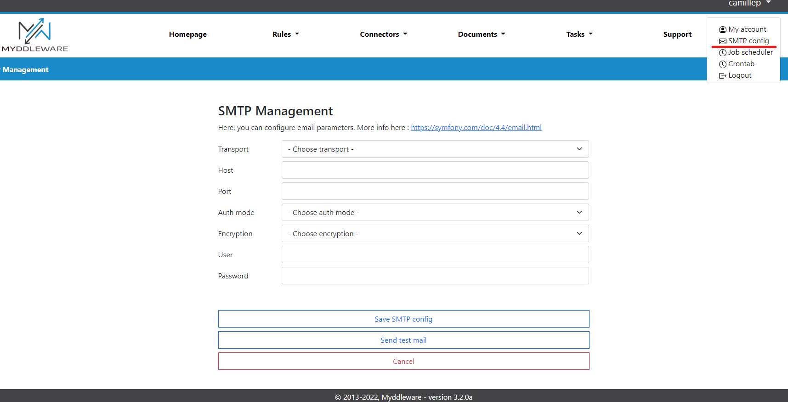

# Email notifications configuration

Myddleware is able to send notifications and alerts using scheduled tasks. For this, you need to configure your SMTP parameters in the 'SMTP config' tab of your user menu.
Here, you will need to fill in the form using your provider's SMTPs parameters & credentials. 
You can test whether the configuration is
correct by sending a test email using the ```Send test email``` button.


